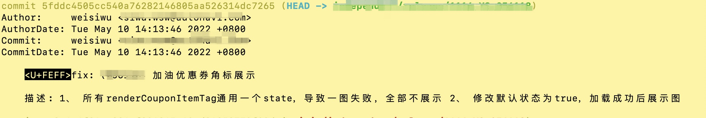
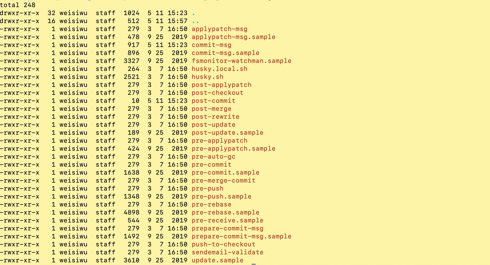
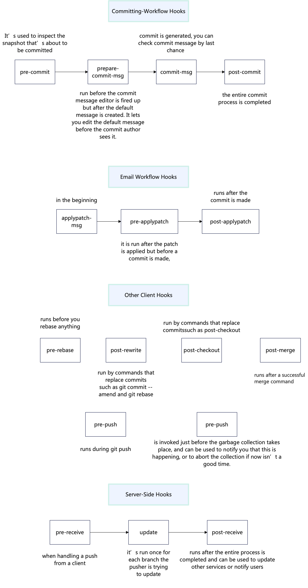

### 序言
很多公司都基于git和gerrit，管理代码的提交和评审。普通commit只包括author/commitor/date/message/hash等基础信息。
通过git hook可向commit信息中附加更多有用信息，加速定位问题。

``` bash
git log --pretty=fuller
```

<p style="text-align: center;">普通commit信息</p>

在向commit message中添加评审相关信息前，首先了解下这些概念:   
**[commit-ish](https://stackoverflow.com/questions/23303549/what-are-commit-ish-and-tree-ish-in-git)**: 又称commit hash，是用于标识commit的唯一标识符。被定义为由commit内容生成的签名哈希，如果commit自身内容发生变化(ammend/rebase/cherry-pick)，commit-ish值就会发生变化。  
tips: commit之前的历史发生变化，也会导致commit hash变化，这是因为git的tree是一个默克尔树，commit的值是每个叶子节点的值。  
**[change-id](https://git.eclipse.org/r/Documentation/user-changeid.html)**: 它是由Gerrit生成的hash字符串，通过git hook将其加到commit 
message中。当用户将commit推送到Gerrit中，系统会自动生成change-id: abc。当推送评审后需要继续改进，用户在本地修改(amend/add new commit)，并重新推送内容。Gerrit 会发现commit-ish发生了变化，但change-id保持不变(值和commit message信息相关)，辨识出本次修改和之前的 change-id: abc 的关联，将其合并成一组，以便评审。  

### 通过 pre-commi hook修改提交信息
Gerrit 提供的钩子接入方法: [cmd-hook-commit-msg](https://gerrit-review.googlesource.com/Documentation/cmd-hook-commit-msg.html)  
下面是操作记录:  

``` bash
# 1. 设置全局模版路径
git config --global init.templatedir '~/.git-templates'

# 2. 创建目录
mkdir -p ~/.git-templates/hooks

# 3. 增加 commit-msg hook 
touch ~/.git-templates/hooks/commit-msg
```
向 commit-msg 中添加如下内容  
``` bash
#!/bin/bash
# 在编辑message阶段，添加上 1) commit初次出现分支名 2) 对应bug链接 3) 对应代码位置
filter=`sed '/^#.*/d' "$1" | grep -o '#\d\{4,\}'`
filter=${filter###}
for i in $filter; do
    issue_link="https://your.issure-base.com/req/"$i
    echo "" >> $1
    echo "[Issue]: $issue_link" >> $1
done;

branch_name=$(git rev-parse --abbrev-ref HEAD)
bundle_name=$(basename `git rev-parse --show-toplevel`)
group_name=$(echo $(git config --local --get remote.origin.url) | grep -oE ':([^/]*)')
group_name=${group_name##:}
commit_id=$(git rev-parse HEAD)
echo "[Frist Branch]: $branch_name" >> $1
```

``` bash
# 4. 修改文件权限
chmod a+x ~/.git-templates/hooks/commit-msg
# 5. 在git repo里面加载对应hooks
git init
```

### 常见git hook
在git repo目录下.git/hooks中，存放着git运行过程中所有的钩子脚本。

<p style="text-align: center;">hooks 列表</p>  
其中以 .sample 结尾的是hooks模板，将结尾的.sample去除并授予文件执行权限即可变成正式的hook。  
常见hooks的执行时机如下:  



### 参考资料
1. [commit-msg Hook](https://gerrit-review.googlesource.com/Documentation/cmd-hook-commit-msg.html)
2. [What is the difference between Gerrit Change-ID and Commit SHA-1 in the context git commits?](https://stackoverflow.com/questions/47808154/what-is-the-difference-between-gerrit-change-id-and-commit-sha-1-in-the-context)
3. [How can I change the default comments in the git commit message?](https://stackoverflow.com/questions/3966714/how-can-i-change-the-default-comments-in-the-git-commit-message)
4. [Git hooks](https://git-scm.com/book/en/v2/Customizing-Git-Git-Hooks)
5. [是否可以向git message中插入hash](https://stackoverflow.com/questions/3442874/in-git-how-can-i-write-the-current-commit-hash-to-a-file-in-the-same-commit)