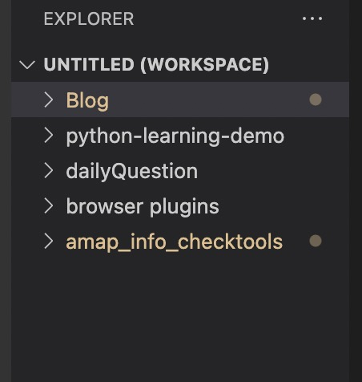
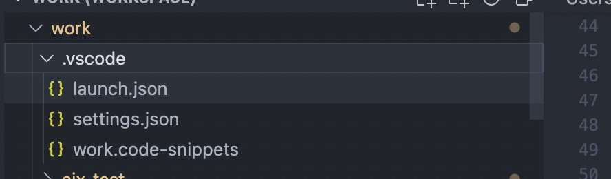
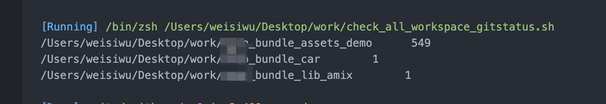

在vscode中配置了workspace后，一个windows下左侧会有多个库文件夹。
  
有时，需要在多个文件下同时进行修改，有些层级还可能在内部依赖目录中(如node_modules)。在最终提交的时候可能会遗漏部分改动。  
为了解决这个问题，我给自己写了一个脚本工具~  
在这里记录一下。  

## 思路
1. 通过shell脚本，直接检查workspace下指定规则的目录。  
2. 通过git status 获得每个目录下的未commit改动  
3. 输出存在改动的目录和对应的改动数目  

这里存在几个问题
1. .和..目录不需要检查  
2. 如何将git status的检测结果简单的输出来  
3. 怎么快速调用这个脚本？我可不想每次都去找到文件然后执行  

对于上面这些问题，我的解决方法是:  
1. 直接判断跳过
2. git status --short  
3. 把shell脚本塞到vscode的快捷键里面去  

思路理完，开工🔽🔽🔽

## 脚本

``` shell
#!/bin/zsh

# excludes folders name not match 'xxx_bundle'
for file in $(ls -a | sort | grep xxx_bundle)
do
  if [ -d $file ]; then
    # excludes ./.. path
    if [ $file = '.' -o $file = '..' ]; then
      continue
    fi
    pushd $file
    modifies_num=$(git status --short | wc -l)
    if [ $modifies_num -gt 0 ]; then
      echo $PWD ${modifies_num}
      # get into node_modules and check modify
      if [ ! -d node_modules ]; then
        continue
      fi
      pushd node_modules
      for node_file in $(ls -a | sort)
      do
        if [ ! -d $node_file -o $node_file = '.' -o $node_file = '..' ]; then
          continue
        fi
        pushd $node_file
        node_modifies_num=$(git status --short | wc -l)
        if [ $node_modifies_num -gt 0 ]; then
          echo $PWD ${node_modifies_num}
        fi
        popd
      done
      popd
    fi
    popd
  fi
done
```

**注意** 这段脚本是用zsh做解释器的，因为zsh的功能比较多，语法用的比较爽，不要用sh去执行。  

## 塞到vscode中  
如何把shell脚本塞到vscode中呢？  
实现分成两步:   
1. 安装[command-runner](https://github.com/formulahendry/vscode-code-runner.git)插件，配置它  
2. 在快捷键中配置一个组合，让他调用comand-runner插件命令去调用脚本。  

那么这里就有几个点需要注意  
1. command-runner 的配置有哪些
2. 怎么设置快捷键？  

**command-runner配置贴**在下面,其存方在workspace的.vscode/settings.json中    
  
``` json
{
  "explorer.confirmDelete": false,
  "workbench.editor.highlightModifiedTabs": true,
  "code-runner.executorMap": {
    "shellscript": "zsh"
  },
  "code-runner.cwd": "/Users/weisiwu/Desktop/work",
  // 最终跑的是这条命令
  "code-runner.customCommand": "/bin/zsh /Users/weisiwu/Desktop/work/check_all_workspace_gitstatus.sh",
}
```

**快捷键**则是直接在vscode ide 的setting中设置。  
下面是我个人的setting(配置文件的位置: ~/Library/Application Support/Code/User/settings.json)  
``` json
// Place your key bindings in this file to override the defaultsauto[]
[
  {
    "key": "ctrl+u",
    "command": "editor.action.transformToUppercase"
  },
  {
    "key": "ctrl+l",
    "command": "editor.action.transformToLowercase"
  },
  {
    "key": "tab",
    "command": "-editor.emmet.action.expandAbbreviation",
    "when": "config.emmet.triggerExpansionOnTab && editorTextFocus && !editorReadonly && !editorTabMovesFocus"
  },
  // 检查workspace下所有目录是否代码均提交，跑的是customCommand下配置的脚本  
  {
    "key": "cmd+shift+b",
    "command": "code-runner.runCustomCommand"
  }
]
```

## 结果
搞完后，直接看看是什么效果吧，冲。  
  