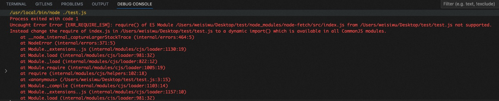
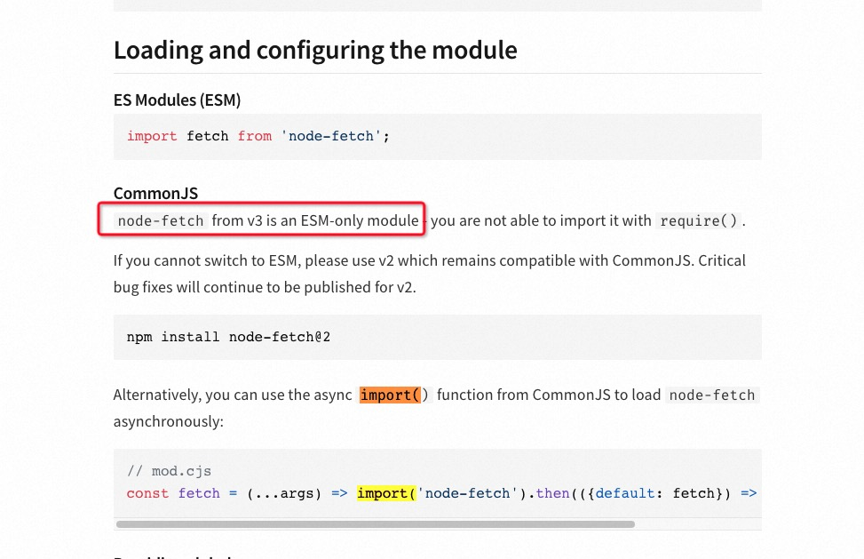
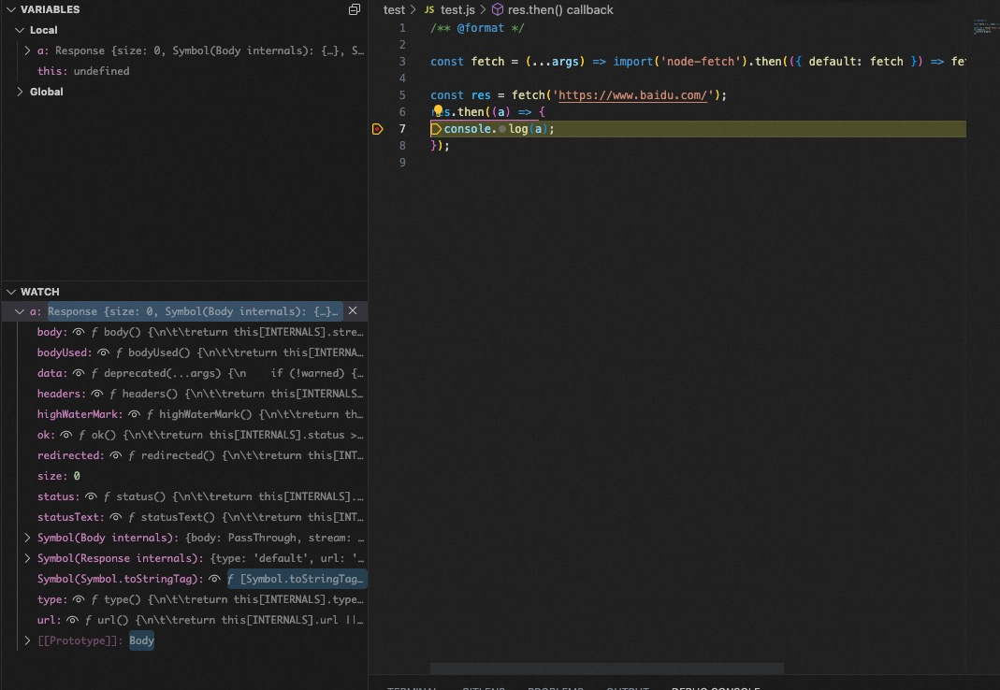

<!-- @format -->

<!--more-->

当我用 `require`引入 `npm`包有双叒报错的时候，我应该先拿出这篇记录瞅瞅，看看是不是这个原因。

在 js 发展过程中，国内常见的模块化方案有

| 规范名                              | 介绍                                                                                                                        |                                网址                                |
| ----------------------------------- | --------------------------------------------------------------------------------------------------------------------------- | :----------------------------------------------------------------: |
| AMD(Asynchronous Module Definition) | 用于客户端浏览器的 JavaScript，为异步模块加载提供了规范。 RequireJS 就是对该规范的一种实现，提供了模块加载器和构建工具。    |        [requirejs](https://requirejs.org/docs/whyamd.html)         |
| Commonjs                            | 用于服务器端的 JavaScript，Node.js 就是基于 CommonJS 规范的模块系统。                                                       | [Node v20.5.1 Documentation](https://nodejs.org/api/modules.html)  |
| UMD(Universal Module Definition)    | 通用模块定义，支持在 AMD、CommonJS 和全局环境中使用。                                                                       |               [umdjs](https://github.com/umdjs/umd)                |
| ESM(ECMA Script Module)             | 在 ECMAScript 6（ES6）中，定义的原生模块化，可以在支持 ES6 及以上的浏览器中直接使用。                                       | [ECMA262-Module](https://262.ecma-international.org/9.0/#table-40) |
| CMD(Common Module Definition)       | 一个在国内比较流行的模块规范，是在 AMD 的基础上进行的一些修改和优化。比较古早的模块化框架，主要实现有 seajs，支付宝早期在用 |            [seajs](https://seajs.github.io/seajs/docs/)            |

如果不关注老旧版本，那只有 `commonjs` 和 `esm` 值得继续关注。

`commonjs`简单规则如下(copy from chatgpt)

> CommonJS 规范是一种用于 JavaScript 模块化的规范，由 Node.js 社区提出，并在 Node.js 中被广泛采用。它定义了一套通用的模块化规则和接口，使得 JavaScript 程序可以方便地编写和维护。
>
> 下面是 CommonJS 规范的主要特点和规则：
>
> **模块定义**
> 在 CommonJS 规范中，一个模块就是一个文件，每个文件都可以看做是一个独立的模块。模块内部的所有变量和函数都是私有的，不会影响全局作用域。
>
> **模块导出**
> 在 CommonJS 规范中，一个模块可以通过 module.exports 或 exports 导出变量或函数。module.exports 是一个特殊的对象，可以用来导出模块的内容。exports 是 module.exports 的一个引用，可以用来简化导出操作。
>
> **模块导入**
> 在 CommonJS 规范中，通过 require() 函数来导入模块。require() 函数接受一个模块路径，返回一个模块对象。模块路径可以是相对路径或绝对路径，也可以是模块名，如果是模块名，则会在 node_modules 目录中查找相应的模块。
>
> **模块缓存**
> 在 CommonJS 规范中，每个模块在第一次被导入时，会被加载并执行一次，然后将其结果保存在内存中，下次导入时直接从内存中读取，而不需要重新加载和执行。这样可以提高模块加载的效率，减少重复的工作。
>
> **模块循环引用**
> 在 CommonJS 规范中，模块可以相互引用，但是如果出现循环引用，会导致模块加载和执行失败。
>
> 总之，CommonJS 规范为 JavaScript 模块化提供了一套简单而有效的规则和接口，使得程序员可以更>加方便地编写和维护 JavaScript 应用程序。虽然 CommonJS 规范现在已经被 ES6 模块取代，但是>在 Node.js 中仍然得到了广泛的应用。

`esm`简单规则如下(copy from chatgpt)

> ESM（ECMAScript Modules）规范是 ECMAScript 6（ES6）中新增的一种模块化规范，被设计为 > JavaScript 中的原生模块系统。它提供了一种简单而有效的方式来组织和管理 JavaScript 应用程序。
>
> 下面是 ESM 规范的主要特点和规则：
>
> **模块定义**
> 在 ESM 规范中，一个模块就是一个文件，每个文件都可以看做是一个独立的模块。模块内部的所有变量和函数都是私有的，不会影响全局作用域。
>
> **模块导出**
> 在 ESM 规范中，一个模块可以通过 export 关键字导出变量或函数。export 关键字可以在变量或函数前面使用，表示将其导出。也可以使用 export default 关键字来导出模块的默认值。
>
> **模块导入**
> 在 ESM 规范中，通过 import 关键字来导入模块。import 关键字接受一个模块路径，返回一个模块对象。模块路径可以是相对路径或绝对路径，也可以是模块名，如果是模块名，则会在 node_modules 目录中查找相应的模块。
>
> **模块缓存**
> 在 ESM 规范中，每个模块在第一次被导入时，会被加载并执行一次，然后将其结果保存在内存中，下次导入时直接从内存中读取，而不需要重新加载和执行。这样可以提高模块加载的效率，减少重复的工作。
>
> **模块循环引用**
> 在 ESM 规范中，模块可以相互引用，但是如果出现循环引用，会导致模块加载和执行失败。
>
> **动态导入**
> 在 ESM 规范中，可以使用 import() 函数来动态导入模块。import() 函数接受一个模块路径，返回一个 Promise 对象，在 Promise 对象被解析后，可以访问所导出的模块内容。
>
> 总之，ESM 规范为 JavaScript 模块化提供了一套简单而有效的规则和接口，使得程序员可以更加方便地编写和维护 JavaScript 应用程序。与 CommonJS 规范相比，ESM 规范提供了更加灵活和强大的模块化功能，是未来 JavaScript 开发的趋势。

```javascript
/**
 * 判断是否支持 ES6 模块
 * 在 support_esm 函数中
 * 1）首先检测 module 对象是否存在，并检测 module.exports 是否是一个对象。
 * 2）然后，使用操作符 in 检测 module.exports 对象中是否存在 __esModule 属性，或者使用 in 检测 module 对象中是否存在 createNamespace 属性。
 * 如果检测到上述属性之一，则说明当前环境支持 ES Modules，函数将返回 true；否则返回 false。
 */
function support_esm() {
  return (
    typeof module === 'object' &&
    typeof module.exports === 'object' &&
    ('__esModule' in module.exports || 'createNamespace' in module)
  );
}

/**
 * 判断是否支持commonjs
 * 1）在 support_commonjs 函数中，首先检测 module 对象是否存在，并使用 hasOwnProperty 检测 module 对象中是否存在 exports 属性。
 * 2）然后，检测 exports 对象是否是一个对象。
 * 如果上述条件都满足，则说明当前环境支持 CommonJS Modules，函数将返回 true；否则返回 false。
 */
function support_commonjs() {
  return typeof module === 'object' && module.hasOwnProperty('exports') && typeof exports === 'object';
}
```

虽然说只有两种需要注意，但是在今天仍然可能遇到一种情况。比如说，当了你准备引入 `node-fetch` 时，在文件中，写下如下内容

```js
const fetch = require('node-fetch');

fetch('https://www.baidu.com/');
```

点击运行，然后给你报错了

原以为 npm 包一定支持通过 commonjs 方式引入，但 error 信息提示，仅支持通过 esm 形式引入。

去官网一查，发现原因是

如果希望继续使用`require`的方式去引入，那么就需要降级到 `v2`。当然，官网也贴心的提示，`v2`仍然在持续维护中。

很感人，不过我选择跟随时代的大船，用`esm`，官方对于这种要求也给出了解决方案:

```javascript
const fetch = (...args) => import('node-fetch').then(({ default: fetch }) => fetch(...args));
```

简单解析一下这个方案

1. 创建一个函数，获取调用函数时候传入的所有参数: `...args`
2. 在函数内部通过`dynamic import`这种异步引入([es6 新增的语法](https://es6.ruanyifeng.com/#docs/module#import))的方法，将 `node-fetch`包以异步方式引入
3. 在成功的`then`函数中，对接收到的对外暴露对象做解构，将 `default`改为 `fetch`，并将第一步传入的所有参数，原样传递给 `fetch`函数并调用。

修改后运行，成功取到返回值

