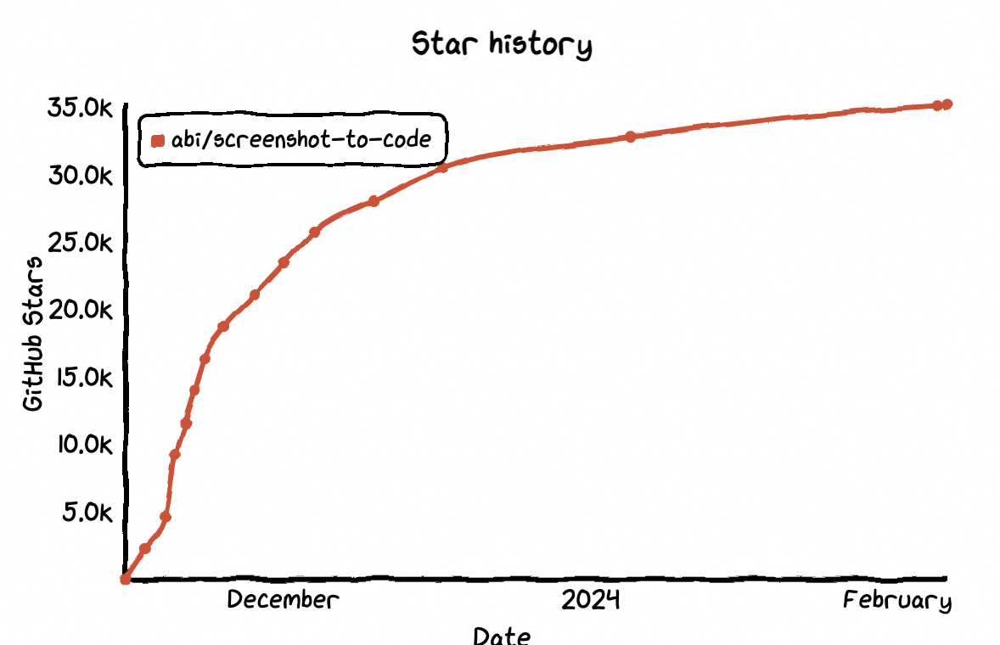
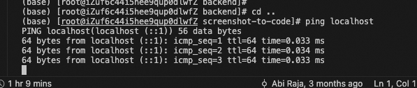
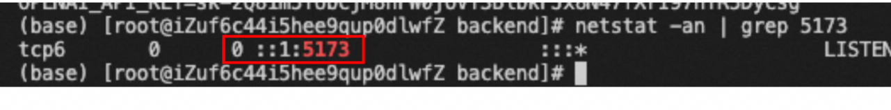

<!-- @format -->
[screenshot-to-code](https://github.com/abi/screenshot-to-code) 是近期在github上很火的GPT衍生项目，其提供web界面去调用GPT-vision接口，进行图生代码的转换。  
在这基础上，还做了前端框架融合（生成的代码使用`tailwindcss`）、server服务集成（代码在[backend文件夹](https://github.com/abi/screenshot-to-code/tree/main/backend)中）。  
在上线两个月后，star数达到了3.1万，热度很高，AI的风潮确实十分的强劲。  



**使用效果可以看这个视频**  

<video id="video" controls="" preload="none" >
  <source id="mp4" src="../images/stc_demo.mp4" type="video/mp4">
</video>

# 安装
下面来简单介绍下，在安装部署screenshot-to-code过程中可能遇到的问题。将分成两个部分来入手介绍。

## 基础依赖
screenshot-to-code项目中包含了前端和后端两部分，分别在frontend、backend文件夹中。需要分别将前后端项目启动，才算完整运行。  
前端部分使用`yarn`作依赖管理，`node`作webui的server环境，后端部分则使用poetry作依赖管理，`python`作api的server环境。同时，为了避免多个环境依赖问题，项目使用docker多镜像联合运行，所以需要本地机器安装了[docker](https://www.docker.com/)和[docker-compose](https://docs.docker.com/compose/)。  
最后，项目的核心能力是通过调用GPT-vision接口实现，所以还需要我们拥有`openai`的`OPENAI_API_KEY`，KEY需要我们在[openai官网](https://chat.openai.com/)上开通GPT4的会员才能使用（GPT4需要付费使用，价格可以参考[Pricing](https://openai.com/pricing)）。  

简单对上面的概念做下介绍:   
- `yarn`: `JavaScript`生态中的一种包管理工具
- `poetry`: `Python`生态中的一种包管理工具
- `docker`: 虚拟化工具，可分割出独立的环境模块，并在其中完成复杂依赖的安装，且不会影响宿主机器和宿主上的其他程序
- `docker-compose`: 将由`docker`虚拟化出的多个环境模块联合到一起的工具，比如将前端的模块、后端的模块联合到一起，组成网站

## 安装运行
### 通过dcokcer

1. **安装docker**  

按照官网给出的只是进行安装即可。  
https://docs.docker.com/engine/install/

2. **安装docker-compose**  

同样，按照官网给出的文档进行安装即可。  
https://docs.docker.com/compose/install/  

3. **下载项目，并开始构建**  
  在前两者下载完毕后，将项目clone到本地，并在终端进入文件夹下，运行`docker-compose`  

```bash
docker-compose up -d --build
```
当然，如果你因为某些原因无法使用docker，那么也可以手动安装依赖，再运行，只是复杂度会上升很多。
下面给出一些手动安装时候，需要注意的坑。

1、`python`需要安装3.12版本   

如果本地已有`python`，那么可以先下载`conda`，然后再通过`conda`下载不同版本的`python`环境。  
这一步很重要，不同`python`版本中的`poetry`最新版是不一样的，比如我最开始使用`python3.6`安装`poetry`的时候，只能安装1.17版本。  
但是`poetry`在1.20版本，有不兼容性升级，而`screenshot-to-code`需要1.2以上，否则无法成功读取backend/`pyproject.toml`的数据。 

```bash
conda create -n py_312 python=3.12
conda init
conda activate py_312
```

2、`poetry`安装时，需要依赖`setuptools-rust`和`rust>=1.48.0`  

`poetry`工具依赖`rust`版本，所以如果希望成功安装`poetry`，还需要先对本机的`rust`和`setuptools-rust`进行安装升级。在安装rust相关依赖的时候，可能会提示没有找到`openssl`，需要安装相关依赖。  
```bash
# 安装poetry，如果遇到提示rust相关问题，执行下面的
pip install poetry==1.4.1

# 下载安装rust
curl --proto '=https' --tlsv1.2 -sSf https://sh.rustup.rs | sh
source $HOME/.cargo/env
# 通过pip安装setuptools-rust，pip是python自带的包管理工具，类似于npm之于node
pip install setuptools-rust
# dnf是linux federo版本下的包管理器
dnf install openssl-devel
# 如果是mac，可以通过brew进行下载
brew install openssl
```

3、在激活环境中，注意检测`poetry`版本  

由于可能会安装另一个版本的`python`，所以一定要注意自己执行的`poetry`版本是否为新版本。
```bash
# 如果poetry版本为1.4.1（或者>=1.2），那么就没有问题
poetry --version
```

4、如果你将服务部署在阿里云的esc上，前后端都成功启动后，通过ip+端口仍然无法访问服务，那你可能要遇到了`TCP6`问题。  

由于服务启动后，监听是`ipv6`地址，但目前阿里云默认没有对外提供`ipv6`的访问，便会出现无法访问的情况。  

  

是否监听的是`ipv6`的地址，可以通过ping本机地址来查看，对于localhost(::1):就是监听`ipv6`  
或者通过查看网络命令  
```bash
# 5173是前端服务的端口
netstat -an | grep 5173
```

  

如果第一列是`TCP6`，则表示服务监听的是`ipv6`。   
解决这个问题，需要将监听的协议类型改成`TCP4`，并把监听的ip地址从`127.0.0.1`改为`0.0.0.0`。  
这需要在启动前后端服务的时候分别指定host  
```bash 
# 启动前端
yarn dev --host 0.0.0.0
# 启动后端
poetry run uvicorn main:app --reload --port 7001 --host 0.0.0.0
```

5、在系统环境中设置`OPENAI_API_KEY`  

这个需要在`openai`去获取，注意: key生成后，会下载到本地，`openai`网站并不会帮我们保存，需要注意保存。  
```bash
cd backend
echo "OPENAI_API_KEY=sk-your-key" > .env
```

6、在云服务中，需要将前后端链接接口链接起来  

如果你将服务部署在云服务上的虚拟机中，那么当前后端被分别启动后，需要通过设置`Vite`配置，让前端能够调用后端接口。  

```bash
vi fonrtend/.env.local
# 添加如下两行
VITE_WS_BACKEND_URL=ws://8.217.183.2:7001
VITE_HTTP_BACKEND_URL=http://8.217.183.2:7001
```

# 思考

由于在之前已用过`GPT-vision`做图转代码，得到的效果并不如意，生成的代码还原度从感觉上，最多三四成，有时候甚至基本结构也无法相同，后续也难以通过`GPT`对之前的结果进行优化。  

所以在跑本地demo前，我认为`screenshot-to-code`会对`prompt`做优化，同时可能采用类似于`Stable Diffusion`的局部重绘机制，提供持续优化方法，使得生成的页面会很贴近图片内容。  

可惜的是，由于`GPT4`是收费的，所以并没有在线demo可供测试。而在本地安装使用后，发现其能力也只是对`GPT4`能力调用的web化封装。而随着`GPTstore`的上线，开放出来很多人的`prompt`，大家的需求也不会满足于单纯的web化封装。  

而项目前端使用的是`nextjs`框架，和数据学习方向，大家常用的`gradio`并不相同，对于后续更多`LLM`类模型接入、各种插件接入，构建生态，并不有利。  

因此，我对项目后续能否顺利发展存疑。前端程序员有自己的圈子，启动项目时也往往使用圈内成熟的框架。但是这个成熟的框架，却可能对未来产生限制，不禁让人思考，技术选型，到底需要兼顾什么？