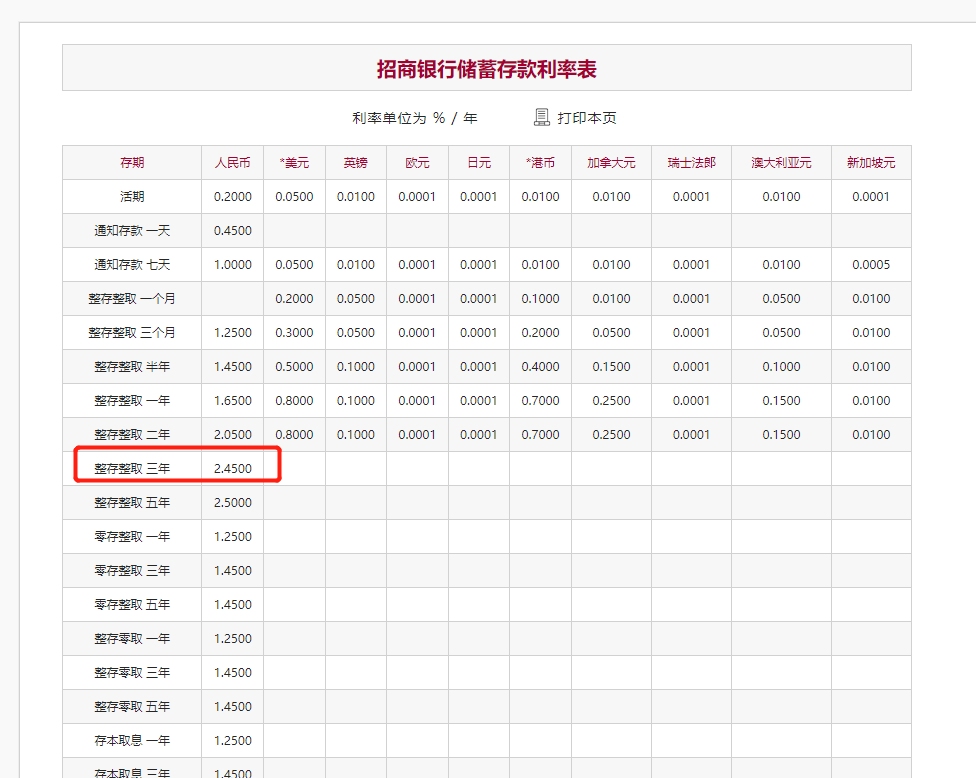
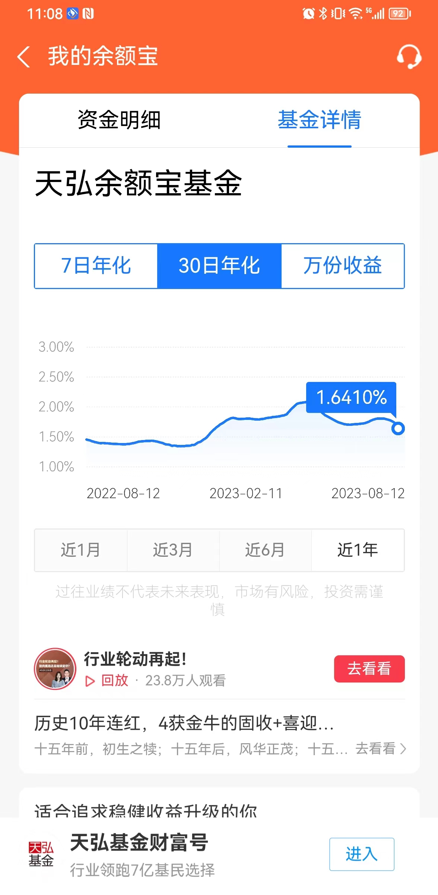
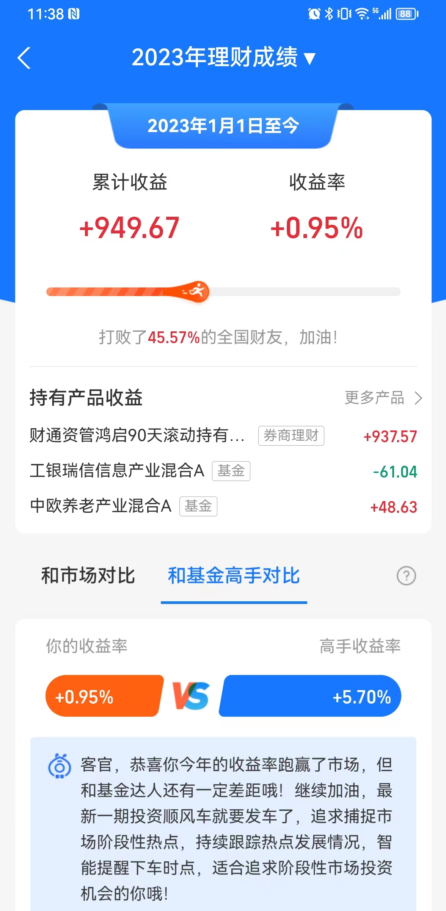
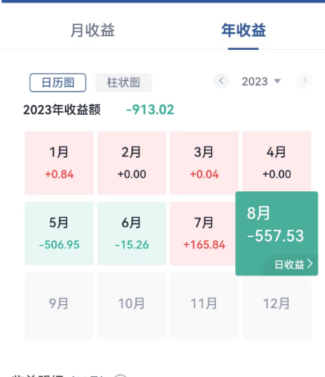

<!-- @format -->

<!--more-->

失败是成功之母。现在，我已经找到成功的母亲了。

<!-- @format -->

# 前言

2023 年初，立下了一个目标，收益率达到 5%。当然，这是作为投资新人立下的目标，到底好不好实现，是否合理，心里也没有个底。

半年过去，在投资上也没有什么思考，偶有行动，都是随大流，比如之前赶了一波超导体的热点，然后亏损了不少。

现在回想起来，觉得十分有必要记录下，2023 年 1 月到 8 月这段时间，在投资上的行动和最终收益。

# 所有投资

## 1、股票-国信金太阳

| 名称                                                               | 代号   | 持有周期                | 至今收益率 | 收益金额 |
| ------------------------------------------------------------------ | ------ | ----------------------- | ---------- | -------- |
| [豫金光铅](http://quote.eastmoney.com/unify/r/1.600531?spm=search) | 600531 | 20230802-20230808       | +2.37%     | +74.70   |
| [上海电气](http://quote.eastmoney.com/sh601727.html?spm=search)    | 601727 | 20230710-20230813(至今) | +0.11%     | +1.52    |
| [奥飞娱乐](http://quote.eastmoney.com/unify/r/0.002292?spm=search) | 002292 | 20230505-20230813(至今) | -14.91%    | -163.01  |
| [养殖 ETF](http://fund.eastmoney.com/159865.html?spm=search)       | 159865 | 20230505-20230813(至今) | -7.20%     | -166.20  |
| [中金岭南](http://quote.eastmoney.com/unify/r/0.000060?spm=search) | 000060 | 20230802-20230813(至今) | -10.46%    | -320.03  |
| [中公教育](http://quote.eastmoney.com/unify/r/0.002607?spm=search) | 002607 | 20230505-20230813(至今) | -20.61%    | -341.02  |

## 2、基金、券商理财 - 支付宝

持有了以下产品
| 名称 | 代号 | 持有周期 | 至今收益率 | 年化收益率 |
| ------------------------------------------------------------------------------------------ | ------ | ----------------- | ---------- | --- |
| [财通资管鸿启 90 天滚动持有中短债债券 C](https://fundf10.eastmoney.com/jjgg_013217_4.html) | 013217 | 20230306-20230813(至今) | +1.10% |+2.509% |
| [招商招财通理财债券型 A](http://fund.eastmoney.com/013217.html) | 004667 | 20230404-20230813(至今) | +0.64% |+1.783% |

而以同期的招商银行的定期利率进行对比

  

三个月的收益率胜过银行: 0.61875% > 0.3125%(银行)  
三年收益率，略微超过利率招商银行: 2.509% > 2.45%(银行)

## 3、余额宝

2023 年 30 日年化高点是 2.08%，远超过招商银行（0.05%）。

  

# 整体收益情况

## 正收益

均由稳健理财获得

  

## 负收益

亏的很多，基本都是股票，国信证券上有个图

  

## 思考

正负收益合计，大概获得了 `36.65元`(949.67 - 913.02)收益，换算为年利率是` 0.05971%`。原本希望是股票本小，冒险获取正收益，拉高整体。

现在看看，自己还是挺有韭菜那味。

现阶段，自己投资的几个点:  
1、投资很随机，喜欢去追热点，并且在有意养成自己追热点的习惯，比如总是提醒自己，某某热点出来了，是否有投资价值？

2、投资前后没有什么调研，基本就是雪球看看评论，看看基本指数等。没有自己的思考、没有自己对价值的思考。比如为什么会挣钱，不知道，只是看运气。钱在我手里，只是撞运气的工具，并没有起到更有意义的作用。

对于第一点，我目前的思考是，不对。

保持对热点的关注对，但是没有什么深层的信息源，也没有特别的专业深度，追热点根本追不上，而且也会迷乱我的思路。后续应当舍弃。

对于第二点，目前没有什么思路。
