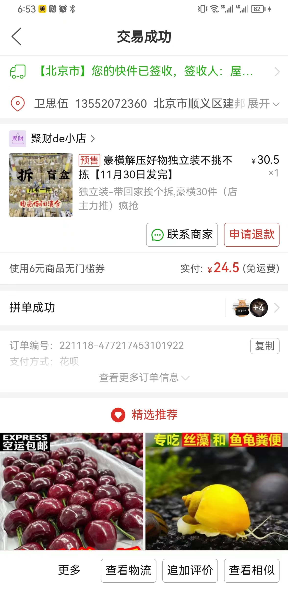
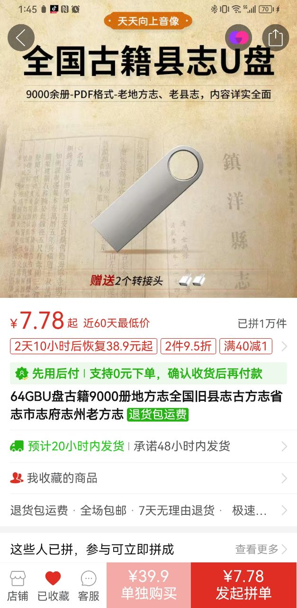
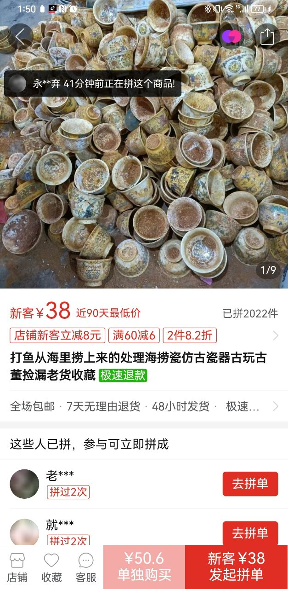
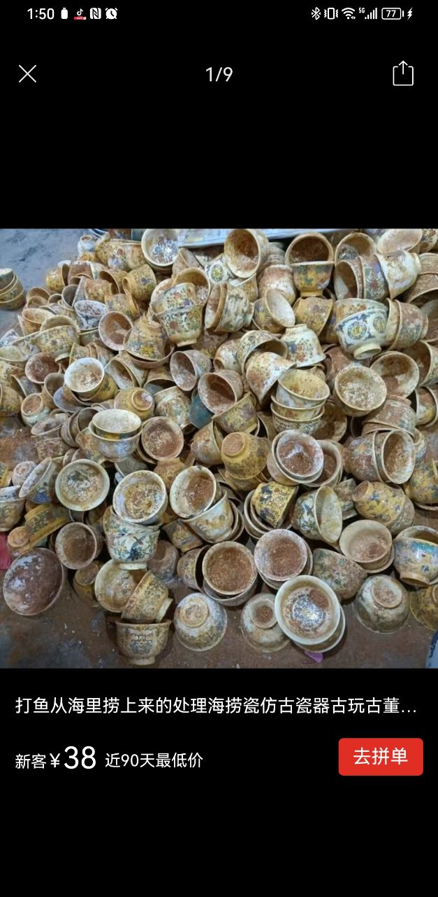

销售的关键是，要能创造需求，也就是常说的卖雨伞给和尚。拼多多上此类各色创造可谓是人类想象力的巅峰体现。  
目前**拼多多是免佣金的**，所以下面涉及的计算，均不考虑佣金。  
<!--more-->
## 案例1: 盲盒
  
### 1、成本估算  
**标价: 30.5元**  
**实付: 24.5元**  
拆开后基本全是无法使用的废物，大致如下:  
1、生锈的钥匙链（多个，不同款式，保存状态都不佳）  
2、单个塑胶桌腿垫  
3、无包装的茶包（多个，均无标志）  
4、单个塑料小花  
5、单个劣质纸红包  
6、单个塑料小铲子  
7、没有标记的装满颗粒的塑料包  
8、单个带味道的塑料拉链包  
物件数量在十几个左右，但是基本不能使用（食品类的不敢食用），加一起估计**不超过10块钱**。  
### 2、利润估算  
最小: 24.5元 - 10元物料费 - 12元快递费(免运费) = 3.5元  
最大: 24.5元 - 0.5元物料费 - 12元快递费(免运费) = 12元  
### 3、潜在风险  
1、投诉  
    20元的价格并不便宜，但是内容物全是废物，很容易会引起冲突，估计商家天天挨骂，同时还得时刻留心客户钻自己的语言漏洞。算是挣辛苦费吧。  
2、运营  
    商家在商品评论区下刷了不少评论，不少带贴图的评论，在盲盒中刷到了高价手办、电子产品。基本可以认为是水军。这笔费用不知道怎么计算的。  
### 4、行业&资质  
### 5、销售额  
### 6、用户评价  

## 案例2: 创意U盘  
64G U盘里，给你装上一堆各式各样的文件、比如县志、历史书、照片、考研资料，卖你三四十。U盘自身大概是不到20块，加上人工、快递等杂七杂八费用，估计一个得有10块左右的利润。  
  
### 1、成本估算  
### 2、利润估算  
### 3、潜在风险  
### 4、行业&资质  
### 5、销售额  
### 6、用户评价  

## 案例3: 钱币    
把新的瓷碗、瓷盘，用泥水弄脏，再卖出去。为啥，因为有人觉得这可能是海底打捞的，在捡漏吧。互联网上的彪悍人生（也许别人没想错）。  
  
  
### 1、成本估算  
### 2、利润估算  
### 3、潜在风险  
### 4、行业&资质  
### 5、销售额  
### 6、用户评价  

## 案例4: 人民币道具  
### 1、成本估算  
### 2、利润估算  
### 3、潜在风险  
### 4、行业&资质  
### 5、销售额  
### 6、用户评价  

## 案例5: 宠物磨牙棒  
### 1、成本估算  
### 2、利润估算  
### 3、潜在风险  
### 4、行业&资质  
### 5、销售额  
### 6、用户评价  

## 案例6: 古玩、纪念品、艺术品  
### 1、成本估算  
### 2、利润估算  
### 3、潜在风险  
### 4、行业&资质  
### 5、销售额  
### 6、用户评价  