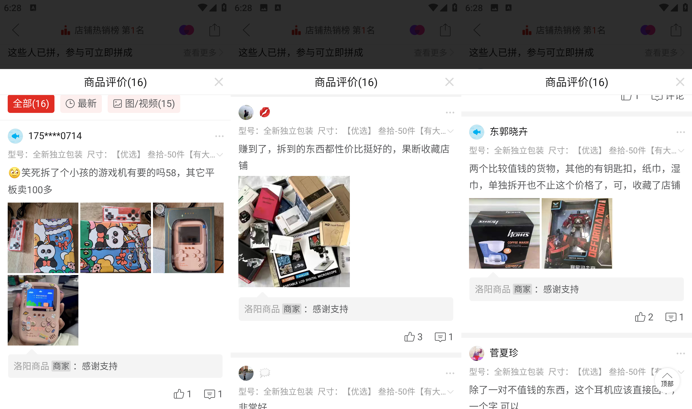
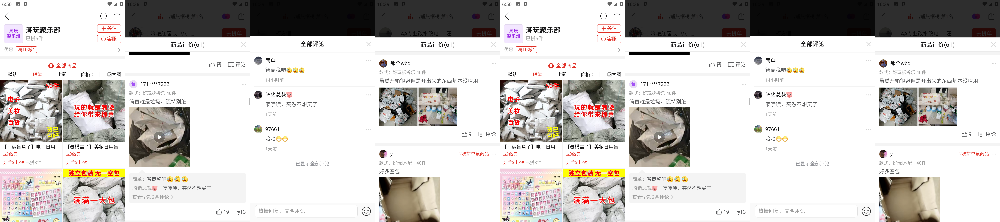
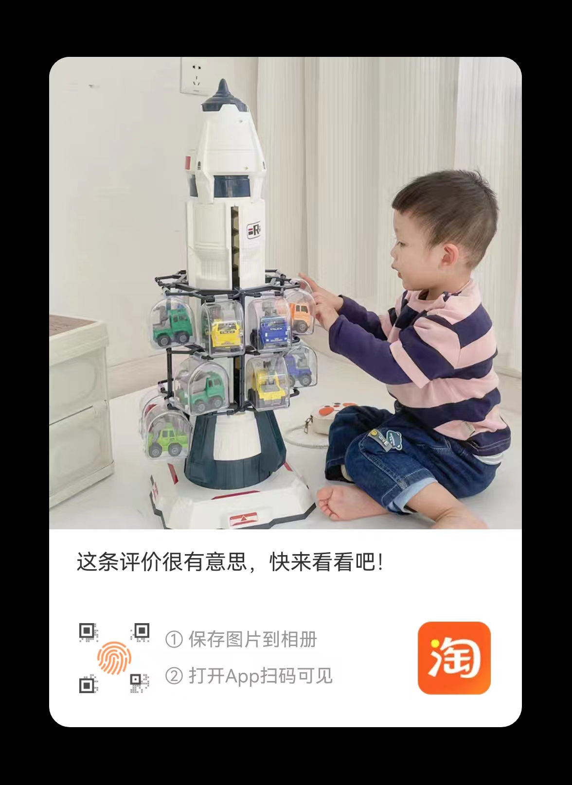
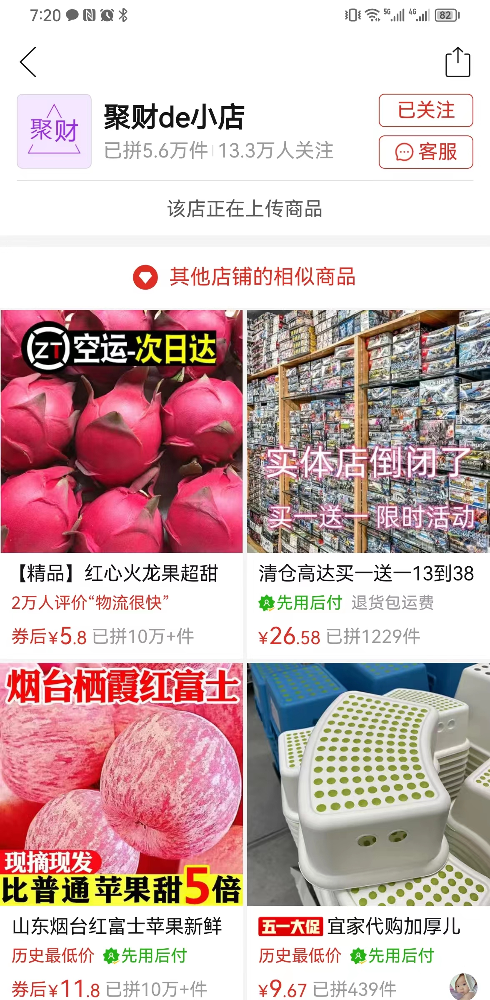
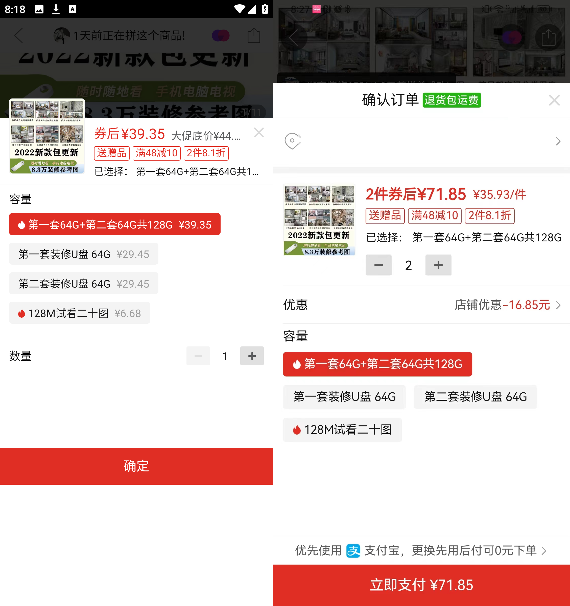
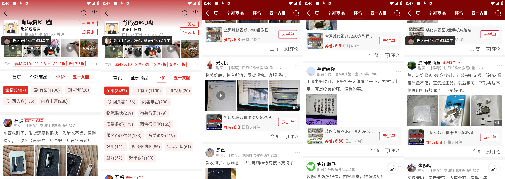

<!-- @format -->

销售的关键是，要能创造需求，也就是常说的卖雨伞给和尚。拼多多上的各色创造可谓是人类想象力的巅峰体现。  
下面是对我日常使用中，遇到的有趣商品、套路的记录和思考。　　
目前**拼多多是免佣金的**，所以下面涉及的计算，均不考虑佣金。

<!--more-->

# 1、盲盒

盲盒，利用用户希望能以小博大，获取巨大性价比的内在心里。将不同价值的物品混在一起打包售卖，是清库存的好手段。
因此，我理解盲盒类商品，需要满足以下两个条件
**１、高价值的物品对用户有吸引力**
**２、用户表面的风险较小**
前者吸引用户，后者则尽量让用户忽视风险，采取行动（购买）。

下面有一些例子

## 玩具店倒闭、玩具大礼包

**_
pdd 上的盲盒商品到店铺
_**
观察到以下点

1. 单个商品价格低廉（1.56-6.8）、好奇每单的利润大概是什么样的？
2. 店铺商品很少，就两款，加上价格低，总销售额不高
3. 商店成本低，商品详情介绍图、商店头图，制作简单，均为实拍图+彩色大号字。
4. 商店已拼商品数量高，但和当前上架商品的总销量不符合（差出好多倍）。
5. 店铺有 5000 多条评论，可以想象到底会有多少客户信息需要反馈，估计处理客户信息、发邮件，就需要不少人力处理，而价格又这么低廉，是如何保证盈利的？
6. 用户评论很多，而且有些评论感觉奇怪:
   1. 一条评论上百条点赞
   2. 有的图打光感觉不错，不像是随手拍照的（照的确实不错）
   3. 有的图显示的物品，价格快 100 了都，有点难以置信

存疑的评论截图

**_
存疑评论截图
_**

**_
其他店铺下的好评
_**

**_
其他店铺下的差评
_**

其中，身着红蓝条纹衣服的小男孩的图最让我起疑，并通过人肉搜索的方式确定了评论存在问题。
首先，疑点有二
**1、评论的图片太好了，但是文字就很简单。有种矛盾感**
**2、图中的物品，看上去就不便宜，如果是一个最高 7 块的盲盒，能中这个，岂不要赔死？**
于是，做出假设
**1、图是扒的，但不知道来源。**
使用 google 搜图，获得图内商品的名称[遥蓝儿童小汽车玩具男孩航天火箭](https://detail.tmall.com/item_o.htm?id=693681025504&pcdegrade=true&de_count=1)

虽然相似的商品在各个网商平台都有售卖，但好在只有天猫的一个 sku 有较多销量，其他销量很少或者为无，因此进一步假设
**图是从评论区来的、或者从商家的拍摄图来的**
后者很快就被大概率排除，因为类似商品用的组图较少，也就几套，通过肉眼确认即排除
前者，在肉眼搜索半天后，终于找到原始出处

**_
天猫评论链接
_**
将拼多多的评论和淘宝的评论进行对比，发现淘宝评论更早（淘宝评论 2022 年 12 月 7 日，pdd 评论 2023 年 4 月 23 日），而且这位顾客既然已经买到了，那么就没有必要再去盲盒抽了吧。

**_
天猫评论内容和 pdd 内容对比
_**
所以可推论出，pdd 的这个商品评论是通过技术手段从淘宝客户这里抄袭来的。
**私域流量互相隔绝，助长了这种侵权行为。让追查变得格外困难。**
对于商家的这种行为，我的疑问如下

1. **这种明显图文不搭配（图好文差）的评论被证明有问题，那些看起来比较正常的评论呢？是不是也是这样？追查难度更高。**
2. **这些虚假评论账号是怎么做到的？背后是人还是机器？**
3. **法律对这些行为的定义是什么？**

## 分析

将这些问题暂时挂起，一个生意要做起来，起码是赚钱的。因此成本、利润、销售额这些关键指标就很重要。
为此，我买了一个盲盒（非上面例图中的商品），以便推算。
**标价: 30.5 元**  
**实付: 24.5 元**

拆开后基本全是无法使用的废物，大致如下:  
1、生锈的钥匙链（多个，不同款式，保存状态都不佳）  
2、单个塑胶桌腿垫  
3、无包装的茶包（多个，均无标志）  
4、单个塑料小花  
5、单个纸红包，纸质感觉不好  
6、单个塑料小铲子  
7、没有标记的装满颗粒的塑料包  
8、单个带味道的塑料拉链包  
物件数量在十几个左右，但是基本不能使用（食品类的不敢食用），加一起估计**不超过 10 块钱**。

这里引出一个问题，**我很难去正确去估算一个物品的实际价值**
基于上面的实付和预计价值，稍稍估算下成本:

**最小**: 24.5 元 - 10 元物料费 - 12 元快递费(免运费) = 3.5 元  
**最大**: 24.5 元 - 0.5 元物料费 - 12 元快递费(免运费) = 12 元

在写文章的时候，购买过的商店已经下架了所有商品。所以没有办法知道具体商品的销量

**_
所有商品已被下架
_**

但是店铺总销售额 5.6 万，而这类店铺，商品数量都很少。**暂假设，共售卖过 5 款商品，且商品平分了销量。**
我买的商品就是 1.1 万，由于货物质量确实不佳，存在大量退货，假设为 20%，则销售量为: 8800，利润总值在: **3.08 万-10.56 万**
当然，这利润肯定是浮在表面的，例如，人员成本、刷评论成本，退货成本、封号冻结的可能性等等都未包括。假设这些能占到三分之二。那么粗算，例如大概在 **1.026 万-3.519 万**
这个利润如果再是几个人合伙做（两个人），还要均分。相当于 **0.513 万-1.759 万**
当然，这种模式很适合于复制粘贴的去扩店推广，因此，较合理的猜测是运营方应该是多店铺运营售卖，去保证利润。

# 2、创意 U 盘

> 人就像一只松鼠，总是在为了过冬，收集根本用不上的东西。

创意 U 盘就是对这句话的很好阐释：将很多文档书籍放到 U 盘中，然后统一进行售卖。
购买者为了知识进行付费，获得了 U 盘+一堆可能永远也学不完的文档，商家则活动了利润，各取所需，双赢。

**_
创意 U 盘商店的商品和店铺情况
_**

## 分析

先估算一下大致成本。在 1688、义务购上，搜索对应内存的 U 盘，价格在 13.25 - 55 元区间。
其中最高价那款，其实和拼多多的创意 U 盘已经类似，做的是车载音乐 U 盘。

**_
批发 U 盘价格一览
_**

根据商家的一些商品信息推断加上实物推断，其购买的应该是 13 左右的 U 盘，走量价格说不定能够更低。

**_
推测 U 盘成本价
_**

> 推断为 13 元 U 盘见上图，两个 64G U 盘，售价 39.35。
> **如果 U 盘高于 19.675 元，那么就完全没有利润空间**
> 实际上，因为有打折、优惠券的缘故，成本实际要更低才能盈利。还是以下图为例，优惠规则为满 48 减 10，2 件 8.1 折，3 件 8 折，下单时，计算的单价（2 pcs U 盘）为 35.93 元，相当于，
> **单 U 盘成本不高于 17.965 元，才能保证利润**

确定了核心点，U 盘的成本，那么利润空间就相对容易猜测
**最小**: 26.45 元 - 13.25 元物料费 = 13.2 元  
**最大**: 17.965 元 - 13.25 元物料费 = 4.715 元

再根据用户评价和实际购得后自我的使用感，凭感觉退一下退货率。

**_
用户评价
_**

感觉较为良好，假设退货率较低，为 10%。
店铺总销售量约 5.5 万件，实际卖出去 4.95 万件。**单店利润在 23.34 万元 - 65.34 万元**
