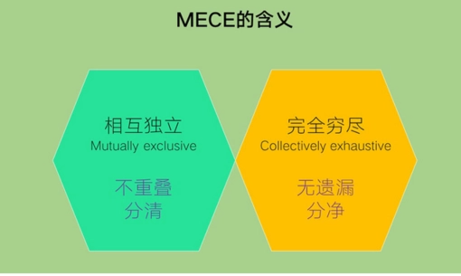
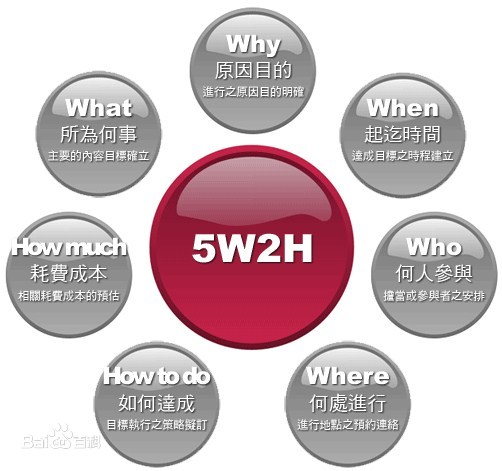
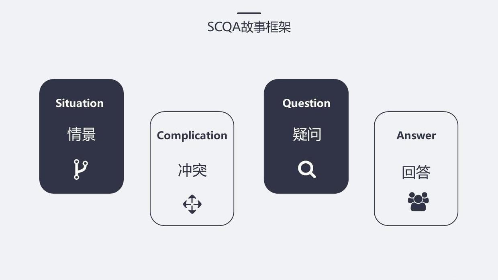
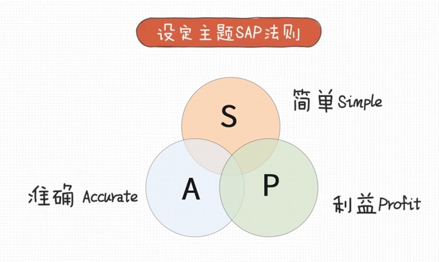

<i>
1、没有万能的方法论  
2、知易行难  
<i>  

<!--more-->

## SP01 透过结构看世界、洞悉事物本质  
> 如果把汉字拆开打乱，让人记住各个部分，会非常的难。但是如果拼成汉字，记忆就很方便。  

造成差距的原因是结构，思考和表达也是一样，要有结构。  
结构化思考的概念是麦肯锡公司提出来的。  
只有思考清晰、才能表达有力。  
 

## SP02 三层次模型，结构思考力的核心理念  
对于不同问题，不同的人有不同的答案、因为每个人思考的角度不同。  
比知识更重要的是基于知识去解决问题的方式、方法、过程。  
结构化思考，就是一种解决问题的方法。  
> 人的思维带有一定的结构，默认的结构可以带我们快速的找到答案，但也可能会禁锢我们的思维和想法  

> 如果一个人面临问题，他想不清楚，就无法说明白。所以为了解决问题，他需要先想明白，想明白后然后付诸实施，对外界施展，就需要表达出来。  

这样的思考过程，经过了3个环节: **理解、重构、呈现**  
这三个环节是结构思考力的三个层次，每一层都有它不同的目标（也可对应提升）  

1. **理解**: 隐形思维显性化、你要提高思考，必须要能看到问题
2. **重构**: 显性思维结构化、看到问题后，思维仍然不清晰，需要结构化
3. **呈现**: 结构思维形象化、结构化后要将它表达出去，这就是形象化
 

## SP03 金字塔结构、结构思考力的训练工具  
> 任何复杂的事情，都要做到在30s内对另外一个人说明白。---- 电梯法则  

**金字塔结构**  
两种子结构    
1. 横向结构
2. 纵向结构 

**顺序上**: 先总后分  
**作用&效果**: 提升思考和表达效率  
 

## SP04 理解: 如何打破“只可意会，不可言传”的僵局  
以什么是好的小笼包为例，讨论好的标准。  
经典的标准是  
> 皮薄、汁多、馅大、肉鲜

但都不能量化，好变成了难以直观的体验，同样的，中医、中餐也有这样的情况。  
与之相反，西方的很多学科，则都是定性定量的描述方式。  
这是东西方思考方式不同的导致的结果，东方偏向整体，西方偏向解构，深入一点。  
要说清事情，首先要能解构、找结构。  
找结构，就要学会分辨事实和观点。观点是思考形成的，只有观点才能成为中心思想。  
有了中心思想，才不会不知所云。  
中心思想是需要被别的观点和事实支撑的，找中心思想也是基于这样的思路。  
摸清结构后，如何快速基于结构快速概括事情，可以使用以下公式:  
> 在__的基础上，  
> 从__，__，__N个方面，  
> 说明了 _____。  

1. **识别**: 识别信息中的事实和观点 （SP05-SP06）  
2. **判断**: 判断事实和观点的对应关系，找出结构  
3. **概括**: 一句话概括所有内容  
 

## SP05 面对纷繁复杂的信息，有自己审视问题的坐标系
> 隐形思维显性化，有效分析信息真伪  

从中美老师教育方式不同引出两点  
1. 思维模式的训练
2. 知识的传递

学习成绩好，但是工作中表现不佳。因为工作中更加看重独立思考能力。标准答案在社会中可施展的空间越来越小。  
在不确定的时代，我们唯有学会独立思考。  
结构化思考是独立思考的前提 by 讲师。  
 

## SP06 任何复杂信息，都可以用一句话讲清楚  
以六神花露水为例，找事实、列观点。  
使用SP04中的规则： **识别、判断、概括**。来总结花露水广告。    
核心点是在如何一句话概括（套用公司）  
<!--  -->
 

## SP07 重构“四核”——结构思考力的四项基本原则
一次车祸后，善后处理有很多事情要安排。   
如果让你安排，该怎么安排？  
1. 先说总的要求，让接受者明白要干啥，效率高
2. 事情多，所以要分类，让问题更简单
3. 分类后要总结提炼，否则内容仍然会很多
4. 这么多的事情，是否有先后顺序  

<!--  -->

总结下来是结构思考力的四个点：   

论: 结论先行  
证: 以上统下  
类: 归类分组  
比: 逻辑递进  

 

## SP08 “论”－结论先行，一句话100%传达你的意思？
重要的事情先说。  
比如有孩子掉下水了，要先说孩子的安危，而不是孩子为啥掉到谁里。  
结论先行的经典示例:  
> 1、政府报告 2、媒体标题 3、咨询公司的报告  

关键点是: 如何得到结论？  
如果别人说的很多，却迟迟没有交代结论，可以用  
● 所以呢 - 引导结果  
● 为什么 - 引导细节  
描述性的内容也可以有结论，结论=有中心思想的主题句  
 

## SP09 “证”－以上统下，让你的观点经得住挑战质疑  
结论概括理由，理由支撑结论。  
否则你的结论、理由会被质疑。  
 

## SP10 “类”－归类分组，让你的表达清晰全面且容易记  
相近的事情放一起，更加容易记忆   
人类一次性记忆的内容是有限制的，所以汇报内容超过7条(概数)时候，难以记忆，建议3条。    
怎么保证分类是清晰的？按照以下原则进行分类    
MECE 原则: 相互独立，完全穷尽（不重不漏）  
  

最好杜绝其他分类，如果有其他分类，说明是分类方式遇到了问题。  
无论事情有多复杂，把事情从某几个维度，看清看全  
创新的某个定义: 打破现有思考框架、建立新思考框架  
 

## SP11 “比”－逻辑递进，让你的观点逻辑严谨且有说服力  
说话的顺序很重要   
顺序不同，则结构不同。结构不同，事物的性质则可能完全不同，比如石墨和钻石。  
逻辑递进  
&nbsp;&nbsp;&nbsp;&nbsp;对要阐述的事情进行排序，大致有三种顺序  
&nbsp;&nbsp;&nbsp;&nbsp;结构顺序、时间顺序、重要性顺序  

wswTest: 补充一个流程图   
复杂的内容内部可能有多重排序方式，去描述其分类、事实、观点。但有一个原则   
同一部分，只能有一个顺序，不要多个顺序混用。   
 

## SP12 描述问题定方向，5W2H描述清楚问题   
透过结构看表达: 前面强调了结构化、这里是将结构化和表达联合到一起。  
如何从无到有的去构建结构: 三个层次、五个步骤   
第一层  
&nbsp;&nbsp;&nbsp;&nbsp;1、 理解描述问题  
第二层  
&nbsp;&nbsp;&nbsp;&nbsp;2、 基于目标定主题  
&nbsp;&nbsp;&nbsp;&nbsp;3、 纵向结构分层次  
&nbsp;&nbsp;&nbsp;&nbsp;4、 横向结构选顺序  
第三层  
&nbsp;&nbsp;&nbsp;&nbsp;5、 形象表达做演示  
引出上面的步骤和层次后，补充说明了如何理解说明问题  
5W2H框架描述问题  
  

要注意，这个框架，是问自己的，让自己更加清晰的描述问题  
还有个 5Why问题分析法 找问题的更本原因  
 

## SP13 确定目标，AB法则让表达有的放矢
做事没有目标，再努力再认真也不行。表达也是一样   
**AB法则**:  受众(Actor)、行为(Behavior)  
目标是指希望受众采取什么样的行为，基于这个目标，再去定主题。  
 

## SP14 设计序言，“SCQA”获得领导赏识的高效沟通公式-
人类的语言有三个阶段  
1. 传递基本信息
2. 说八卦信息
3. 说不存在的事物  
3就是类似于讲故事，可以组织起大批量的人，向一个目标前进。  
讲故事的套路: **SCQA**  

不是让你去讲故事。而是用讲故事的方式去和别人沟通。  
要结论先行，但是更要先把对方吸引过来。  
这些要素的顺序，随意调整，按照需求去变。  
 

## SP15 设定标题，SAP法则，设计一个吸引读者眼球的标题  
主题就是解决方案，但是从标题的角度考虑，希望表达更好  
一个好的标题包含了3个要素:  **SAP**  
  
上述可以用于副标题。  
后半部分，总结了第二部分，结构化思考后描述问题的几个步骤  
1、 目标 2、序言 3、 主题  
 

## SP16 自上而下，疑问回答搭建框架
有了目标和主题后，开始搭结构  
1. 先抛出观点，看对方关心什么，列出问题  
2. 设想问题，回答问题  

将对方想听，能听懂的 -- 如何做到？  
否则会轰轰烈烈讲了30分钟，对方睡着了。  
> 自己立主题，让后扔给对方，设想问题，回答问题，循环不断使用。  
> 这样对方有兴趣听，你也有利益讲  

这些问题要做到  
1. 你要站在对方的角度去想  
2. 你的答案要能完全回答这个问题  
 

## SP17 自下而上，概括总结做聚合
> 我们应当如何如何，这就是没有结论，没有中心思想的主题句

由下向上概括总结式的步骤  
行动性概括: 行为动作的概括  
描述性概括: 对场景、数据的概括  
但是都可以按照如下步骤做概括  

1、为了寻找共性，必需要求分类是清晰的  
2、下面的要点，首先得是结论  

同一套数据可能有很多共性，取哪个共性，取决于你的目标  
后面是对纵向结构的总结  

1、目标明确用自上而下:  换位思考，有吸引力，有说服力  
2、目标不明确用自下而上（没有目标的时候）:  可以验证自己的结论是否成立  

但是实际中一般都是混着用。  
 

## SP18 横向结构选顺序  
作为结构，要清晰，也要符合逻辑。如何让结构符合逻辑？   
<!--    -->

这一章，主要说的是横向结构中有哪几种结构  
演绎没有新知识、归纳有新知识，但是不保真  
演绎一般是三段式结构: 大前提、小前提、结论  
 

## SP19 选择演绎，让说服更有力
两种模式:   
&nbsp;&nbsp;&nbsp;&nbsp;标准式: 大前提、小前提、结论  
&nbsp;&nbsp;&nbsp;&nbsp;常见式: 现象、原因、解决方案  
 

## SP20 选择归纳，让要点更清晰
归纳里面最重要的是分类  
标准化、流程化、SOP都是结构化  
横向归纳的核心是分类和排序  
封闭式分类: 套用别人总结的经验，进行分类  
开放式分类: 自己想办法，遵循MECE  
MECE小工具1: 2*2矩阵 (比如 时间X重要性)  
最后总结:  
&nbsp;&nbsp;&nbsp;&nbsp;归纳让观点清晰、条理清晰  
&nbsp;&nbsp;&nbsp;&nbsp;演绎说服力强  
 

## SP21 结构罗盘一张图说清所有工作内容
结构思维形象化第一部分  
讲师的建议是，有了结构化思考后，使用“配得上”原则  
这里主要说的是怎么去做PPT。  
 

## SP22 配关系，四大模式十六种结构
四种模式  
1、关系模式  
2、比较模式  
3、作用模式  
4、流动模式  
本章就是简单的罗列和说明  
 

## SP23 得图示，每种关系匹配一类图示
列出关系，就可以配置出图来进行表示  
不同模式的不同结构都有默认图，见SP21大罗盘里面的。  
 

## SP24 “上”包装，让观点更吸引人、更容易记
让你的观点更容易吸引人，更容易被记住，是宽泛的介绍。  
 

## SP25 结构化思维核心内容回顾及练习建议
1、个人，如何运用  
&nbsp;&nbsp;&nbsp;&nbsp;多实践。牢记论证类比  
2、团队、如何运用  
&nbsp;&nbsp;&nbsp;&nbsp;不用管他说了啥  
3、社会，有何益处  
&nbsp;&nbsp;&nbsp;&nbsp;面临不确定性，如何解决问题？  
&nbsp;&nbsp;&nbsp;&nbsp;思维能力的训练</spam>  