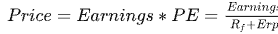

---
title: 【读书笔记】美股、美债、美元和商品.md
date:
excerpt: '美股、美债、美元、商品这四者之间是怎么样的相互影响关系？'
photos: '../images/美债2.jpeg'
tags:
- 经济
categories:
- 读书笔记
---  

<!--more-->
内容收录自: [美股、美债、美元、商品这四者之间是怎么样的相互影响关系？](https://www.zhihu.com/question/26163000)  

美债收益率是大类资产研究的起点。  
机构投资者做资产配置时，一个很重要的考虑因素就是[资产收益率](https://baike.baidu.com/item/%E8%B5%84%E4%BA%A7%E6%94%B6%E7%9B%8A%E7%8E%87?fromModule=lemma_search-box)与[负债匹配](https://wiki.mbalib.com/wiki/%E8%B5%84%E4%BA%A7%E8%B4%9F%E5%80%BA%E7%AE%A1%E7%90%86)。
而美债收益率是全球负债端的锚，利率上行会抬升负债端成本，进而导致资产端出现调整。  

## 利率
- **经济向好，利率会上升**
- **货币政策收紧，利率也会上升**
  
所以利率上行既可能反应的是经济的好转。  
一般而言，债券利率按短端、中端、长端划分，分别对应1-2年、5-10年、30年期。  
越短端的利率越反应货币政策的取向，也就是流动性的松紧程度，越长端的利率越反应经济增长。  

## 股市和利率
### 股市的决定因素  
- **盈利**
- **无风险利率**
- **风险偏好**

  
决定因素导致股票的牛市出现。  
- 业绩牛
    > 盈利好的时候，分子上升，股市自然有向上拉力；
- 水牛
    > 货币宽松时，利率下行，分母减小，股市有向上推力；
- 改革牛
    > 市场非常看好改革预期，风险偏好很高，愿意为神话故事买单，同样引起分母减小，股市有向上推力。  

 

### 利率对股市的影响
矛盾的是，利率下行会从分母端利好股市，却也会从分子端利空股市，因为利率下行意味着经济下滑，盈利下降。  
所以要将股市区分为价值股和科技股：  
- 价值股一般市值大、估值稳定，主要看盈利变化；

- 科技股一般估值高，增速快，主要看分母利率的影响；
    > 利率上行，利好价值股，道琼斯＞标普500＞纳斯达克；  
    > 利率下行，利好科技股，纳斯达克>标普500>道琼斯；  

## 美元和利率
市场上聊美元走势，基本等价于是聊**美元指数**。  
于是在聊美元时，其实是在聊美国相对于欧洲、日本等非美经济体的经济、金融情况。  
简单来说，如果美国经济比欧洲好，或美国货币政策比欧洲紧，那么就隐含了美债利率比欧洲高，资本从低利率国家流入高利率国家，导致美元回流和走强。  
- 美国经济好，美债就上涨。如果这时，欧洲、日本等非美经济体经济不如美国，那么美元就会上涨。但如果非美经济体经济比美国还强，那么美元就会下跌。
- 美国经济差，美债就下跌。如果欧洲更烂，那么美元也是上涨，如果欧洲没那么差，美元就会下跌。
一言概之，美元指数，表示美国经济相对其他主要经济体好坏的相对指数。  

## 商品和利率
商品需要分为几大类：  
- **农产品**
- **工业品**
- **贵金属**

**农产品**是基本与利率关系不太直接,这里略去。  
**工业品**的话，大多数情况，利率上行利好工业品，工业品和经济增长直接相关，经济复苏和过热时，利率上行，工业品价格都上涨。  
但有时候利率上行，工业品价格下跌，这反应了市场对经济过热、通胀上行后，对货币政策紧缩的担忧，以及政策给经济降温的预期增强，所以大宗商品价格会下跌。  
贵金属以**黄金**为例，牢记一点，与**美元实际利率**反相关即可。因此，名义利率走高，如果通胀上得更快，实际利率向下，利好黄金；名义利率走低，但通胀没怎么下去甚至上升，实际利率也是下行，同样利好黄金。反之亦然。  
> 1980s，美国恶性通胀期间，黄金从180美元/盎司能涨到800美元，2020年3月至8月份，黄金从1200美元/盎司涨到2000美元，都是如此。  

 

## 总结
利率与大类资产的关系扑朔迷离的根源在于：  

**一、没有理清资产由什么决定的**  

例如美元由相对利率决定，黄金由实际利率决定，工业大宗商品由通胀预期决定，股票由盈利和估值决定等等。每一个决定因素都与利率有关联，但又不完全一致，导致仅看利率与资产的二元关系，就会觉得没有规律可言。事实上，剥茧抽丝，厘清资产价格决定因素和利率之间的关系，才能更好地掌握利率与商品、美元、股票之间的联系。  

**二、超预期的变动才能影响资产价格**  

资产价格是由不同交易者的预期，相互作用而成的。如果大家都能预期到利率下行，那么资产价格早就在交易中得到了充分体现。以黄金为例，可能1800美元/盎司的黄金隐含了3%的通胀，一旦通胀不及预期，那么就可能跌破1800，但是超预期就可能继续涨。所以并非高通胀就一定涨，还要关注边际变化。  

 

## 部分概念
- 估值： 机构的预期价格  
- 市值： 公开市场上的价格  
- 负债匹配： 指金融机构按一定的策略进行资金配置来实现流动性、安全性和盈利性的目标组合。  
- 资产收益率： 用来衡量每单位资产创造多少净利润的指标。