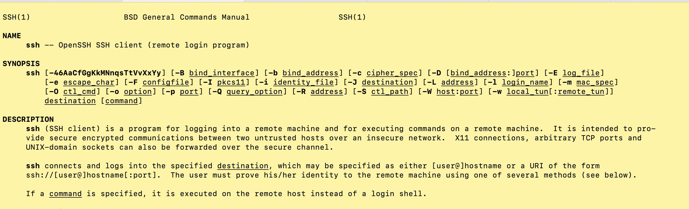
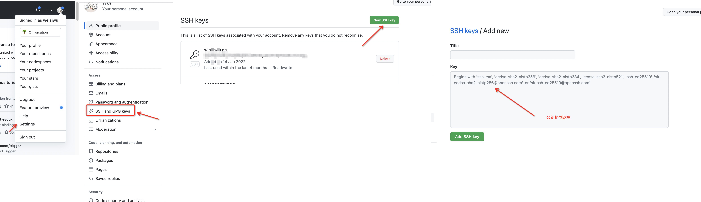

### 简介
ssh是一种网络协议，用于计算机之间的加密登录。  
在类linux电脑中，提供了按照ssh协议实现的脚本命令。  
   

<p style="text-align: center">ssh man page</p>  

协议和ssh的关系类似于[SCM](https://www.atlassian.com/git/tutorials/source-code-management): 版本控制系统和[git](https://git-scm.com/)。  
最常见的使用场景是，向github、gitlab类网站添加ssh公钥，完成对电脑的授信。

<p style="text-align: center">ssh认证流程</p>  

### 初始化配置
下面是初始化ssh-key并配置到github上  
``` bash
# 全局配置git用户名和邮箱
git config --global user.name 'weisiwu'
git config --global user.email '2436887475@qq.com'
# 进入当前用户的根目录
cd ~
# 删除已经存在的 .ssh 目录(可不要，后续覆盖已有也可)
rm -r .ssh
# 运行命令生成密钥，输入后会让输入，一直回车即可(中间有让输入passphrase，默认为空，
# 输入了后续每次向github提交代码都要重新输入)
ssh-keygen -t rsa -C 2436887475@qq.com(你的邮箱)
# 进入存放秘钥的文件夹并查看
cd .ssh && ls -al
```

<p style="text-align: center">秘钥</p>  

``` bash
cat id_rsa.pub
```

<p style="text-align: center">公钥</p>  

复制公钥内容后，按照图示将其添加到github中(完成添加流程)   




### 多实例配置  
初始化配置里，直接通过删除(覆盖)原有ssh key来添加新的秘钥。  
但现实场景中，一台机器可能要在多个网站上添加不同的公钥: 公司使用公司邮箱生成的公钥、个人使用个人邮箱生成的公钥。那怎样才能在一台机器上添加多个秘钥，并让其自动发挥效用呢？  
下为此问题的解决记录。  
``` bash
# 检查机器默认位置，是否已有ssh配置
ls -al ~/.ssh
cd ~/.ssh
# 如果已经存在秘钥，则制定其他文件名重新生成秘钥
ssh-keygen -t rsa -f id_rsa_selfuse -C 2436887475@qq.com(换成公司或个人邮箱)
# 生成新公钥后，按照初始化中添加到github的步骤，将其同样添加进去
```

<p style="text-align: center">添加指定公钥</p>  

``` bash
# ssh agent(ssh 代理)用来管理一个多个ssh密钥，并为其他需要使用ssh key的程序提供代理，详见参考文章-4
# 用它可帮我们在不同域名下自动选择秘钥。
# 此命令也可更换为: eval $(ssh-agent)
ssh-agent bash
# ssh-add命令是把密钥添加到ssh-agent中，其无法永久性记住你所使用的私钥。
# 实际上，它的作用只是把你指定的私钥添加到ssh-agent的session 中。当重启机器后，ssh-agent和ssh-add的秘钥也就重置了。
ssh-add id_rsa_selfuse
# 添加完成后，查看已经添加的秘钥
ssh-add -l
```
  

``` bash
# 在.ssh目录下创建config文件，ssh通过这个才知道哪个私钥去对应哪个公钥
touch config
```
在config文件中输入以下文本:   
``` plaintext
# self github
Host github
HostName github.com
IdentityFile ~/.ssh/id_rsa_selfuse

# 各配置项意义
# Host: 主机别名
# HostName: 托管平台域名地址，如github.com
# IdentityFile : 指明上面User对应的identityFile路径
# User: 托管平台用户名
# Port: 端口号，可不填（如果不是默认22号端口则需要指定）
```
``` bash
# 配置完成后，测试秘钥是否配置成功
ssh -T git@github.com
```
  

以上，所有配置就完成了，在电脑上通过ssh去访问配置好的网站吧~~   

### 参考文章:
**1. [SSH原理与运用（一）：远程登录](https://www.ruanyifeng.com/blog/2011/12/ssh_remote_login.html)**  
**2. [Secure Shell](https://zh.m.wikipedia.org/zh-hans/Secure_Shell)**  
**3. [什么是SSH？](https://info.support.huawei.com/info-finder/encyclopedia/zh/SSH.html)**  
**4. [ssh agent详解](https://zhuanlan.zhihu.com/p/126117538)**  