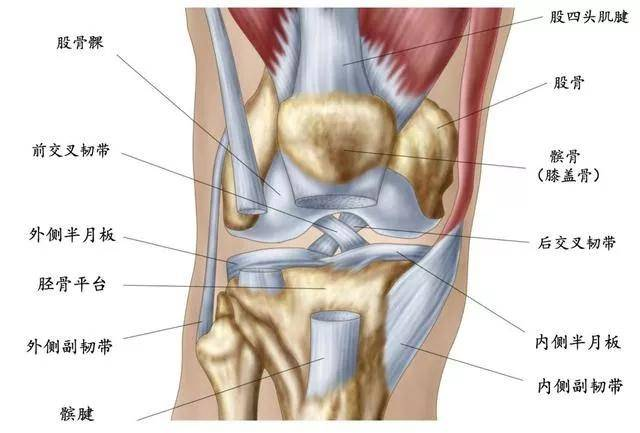
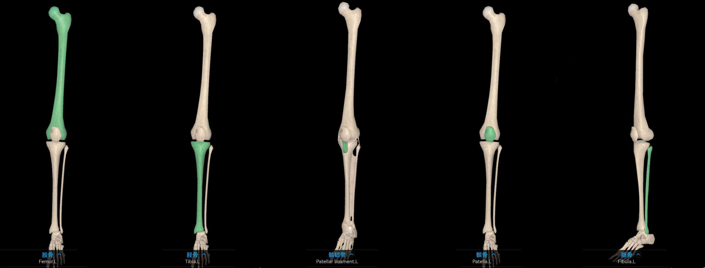
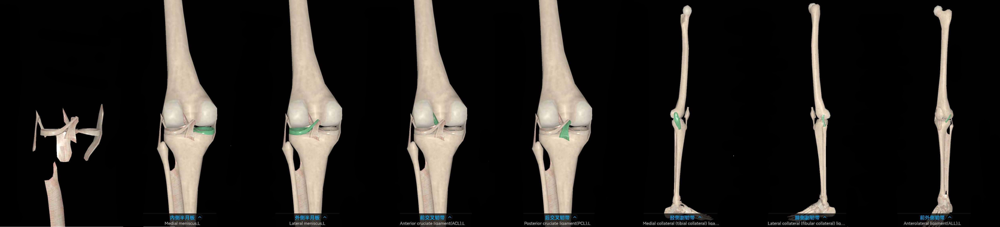
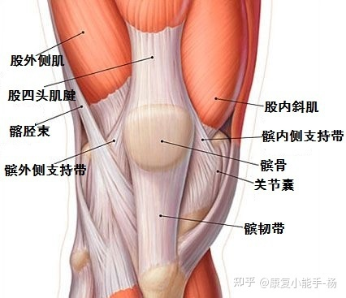
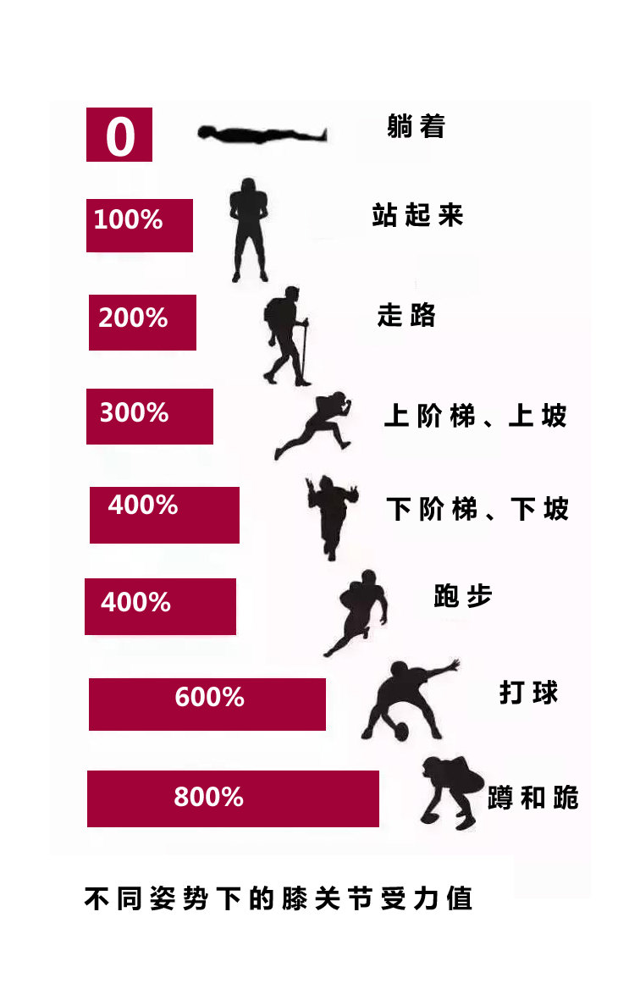

膝盖，作为人体最大最复杂的承重关节。它的“设计使用寿命”约为60年，“到期”以后，各种膝盖疾病患病率大幅上升，在我国膝关节炎患者人数达1.2亿。
人体的关节是由纤维结缔组织、 软骨与骨连接形成，外面包裹着关节囊，与关节构成了一个封闭的关节腔，这个空间里存储着关节滑液，起到润滑、缓冲的作用，使得我们能够活动自如。

### 膝盖结构

腿骨

**胫骨**对支持体重起重要作用，是我们小腿骨中的**主要承重骨**。
**髌骨**的主要作用在于**缓解**运动时，骨骼和肌肉之间的**摩擦，保护膝关节**。
**股骨**是人体最重要的骨骼，我们直立行走、活动、劳动，都依靠**股骨头**的**支撑作用**。

关节软骨和韧带

### 不同阶段的膝盖

**15岁以前：**
发育: 膝关节处于发育阶段，青春期的生长痛多发在膝关节附近。  

**15岁~30岁：**
完美: 膝关节处于“完美状态”，运作起来可以说是不知疲倦。只要不破坏到膝关节组织，基本都感受不到它的存在。  

**30岁~40岁：**
不再随心所欲:  髌骨软骨出现早期轻度磨损，在这段时期内要剧烈运动要开始减少。  

**40岁~50岁：**
保养: 在走远路之后，膝关节内侧容易出现酸痛，用手轻揉之后会缓解。此阶段半月板的开始退变，引发关节酸痛。 

**50岁以上：**
适应老年生活: 膝关节时常会感觉到明显疼痛，是因为髌骨软骨的“使用寿命”已到，软骨全层磨损，关节炎已经产生。这时候应该节约使用关节，减少剧烈运动，尤其是上下楼梯和爬山，必要时可以使用拐杖来减轻膝关节承受的压力。  

### 常见伤病
#### 1、关节炎
**骨性关节炎/类风湿性关节炎**  
骨关节炎是指关节内的组织随时间的推移而分解，疾病累及软骨、关节囊，滑膜或整个关节。多见于中老年人，女性多于男性。  
类风湿关节炎是一种病因未明的慢性、以炎性滑膜炎为主的系统性疾病。其特征是手、足小关节的多关节、对称性、侵袭性关节炎症，可发生于任何年龄，高发年龄为40～60岁。女性好发，发病率为男性的2～3倍。  
会导致: 关节疼痛、压痛与关节肿胀、活动障碍（难完成通过膝关节承重的动作）  

#### 2、关节内软组织损伤
**半月板损伤/交叉韧带损伤**  
半月板损伤: 当膝关节屈曲时，由于旋转，内外侧半月板可随股骨发生前后运动。当这种矛盾运动超出正常范围时，就可能发生半月板的撕裂。  
会导致: 疼痛、膝盖肿胀、肌肉萎缩、关节卡锁（腿无法伸直）  
交叉韧带损伤指的是膝关节内的交叉韧带由于剧烈运动（比如: 小腿外翻半屈曲位，多在单脚落地时发生）、车祸等因素发生了损伤。  
会导致: 疼痛（关节内）、膝盖肿胀、膝关节不稳，腿软，丧失部分运动能力: 急停、急转、突然加速  

#### 3、伸膝装置的损伤  
伸膝装置指的是股四头肌-髌骨-髌腱的连接，常见的相关疾病有  

**髂胫束摩擦综合征**  
髂胫束的主要作用是限定髋内收和膝内旋。当膝关节由完全伸直到屈曲时，髂胫束从股骨外侧髁的前方移至后方。跑步时反复屈伸膝关节使得髂胫束在股骨外侧反复摩擦，产生的水肿充血、无菌性炎症。  
会导致: 膝关节外侧疼痛  

### 科学护理
**1、 合理运动:**  
关节间的软骨本身几乎没有血液供应，需要通过滑液来提供氧气和营养，运动时关节面上受到压力压迫滑液渗入软骨内部，完成供养。缺乏运动会导致滑液渗透软骨不足，软骨细胞缺乏营养导致受损。  
最适合膝关节的运动是：游泳、骑车，对于普通人来说，对关节最有好处的运动就是游泳。在水里人体是与地面平行的，关节基本不负重。有糖尿病、高血压等慢性病的人多游泳，对全身都好。为了达到锻炼身体的目的，可以选择游泳、骑车、做体操等关节负重较轻的运动。   
研究表明，站起来和平地走路时负重是体重的2 ~ 3倍，上下坡或上下楼梯时是3～4倍，跑步大约是4倍，蹲和跪大约是8倍。  
   
所以一定要注意运动姿势:  
1）不要只用某只脚的一侧着地。应该尽量避免进行负重时的膝关节屈伸活动。  
2）不在坚硬的地板上做剧烈运动，比如下蹲、蛙跳、跑步、跳绳还有跳舞，都会加重对膝盖骨的磨损，尤其是蹲下去再站起来，对关节的磨损最大。关节软骨大概有1到2毫米，作用就是缓冲压力，保护骨骼不破裂，在坚硬地板上运动，在超强的反作用力下弹回来，对关节和骨骼的损伤相当大。因此，建议多在橡胶运动场地做运动。  

**2、注意饮食&控制体重**  
减肥，减轻自重是肥胖者保护膝盖的首选任务，过重的体重时时刻刻的伤害着膝盖。  
多吃一些有助于关节软骨修复的食物如白木耳、贝类、螃蟹（关节修复很困难，这个更多是补足营养）。  

**3、注意休息**  
需要经常半蹲位工作或常弯腰负重工作的人员，避免长时间下蹲，因为下蹲时膝关节的负重是自身体重的3～6倍，工作时下蹲最好改为低坐位（坐小板凳），长时间坐着和站着，也要经常变换姿势，防止膝关节固定一种姿势而用力过大。  

### 参考资料
1、 [保护膝盖最好的方法是不是就是不运动？](https://www.zhihu.com/question/399157144)  
2、 [认识我们的膝盖](https://zhuanlan.zhihu.com/p/116564986)  
3、 [膝盖最常见的4大疾病和主要症状](https://www.sohu.com/a/164517515_444002)  