### 货币的形成
在古代，人们通过渔猎种植进行生产收获。因为生产力限制，需要进行以物易物的交易来交换需要的物资。随着交换越发频繁和复杂，人们创造出了最初的货币。 在中国，最初的货币形式是贝币，人们通过将收集来的海贝(如 [黄宝螺](https://baike.baidu.com/item/%E9%BB%84%E5%AE%9D%E8%9E%BA/5912330?fromtitle=%E8%B4%A7%E8%B4%9D&fromid=2339214&fr=aladdin))，通过磨平打孔方式制成货币。 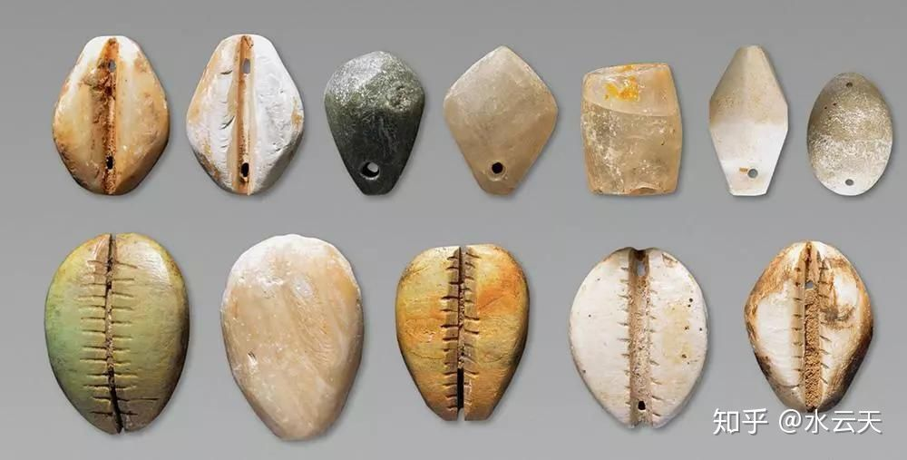 请思考: 中国古代文明的发源地是黄河流域，而贝币主要是海贝，这是为什么？ 
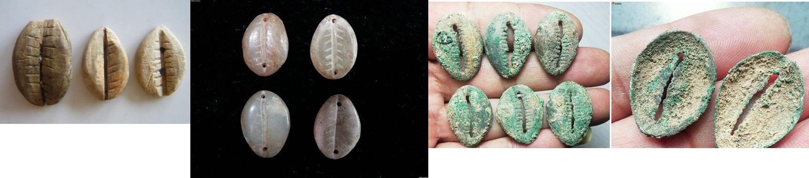 不同材质的贝币 在货币出现后数百年间，随着商品经济的发展，天然的贝壳作为货币渐渐供不应求了，于是出现人工贝币，如石贝币、骨贝币、蚌贝币等。到了商代晚期，出现了用铜质的金属贝币

### 货币制度统一
从商朝铜币出现后到战国时期，中国的货币形状很多。比较出名的有四种:  赵国铲币(又称布币) 
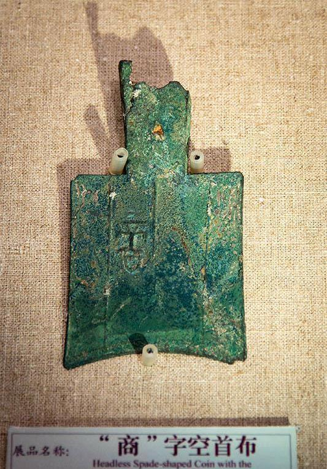 齐国刀币 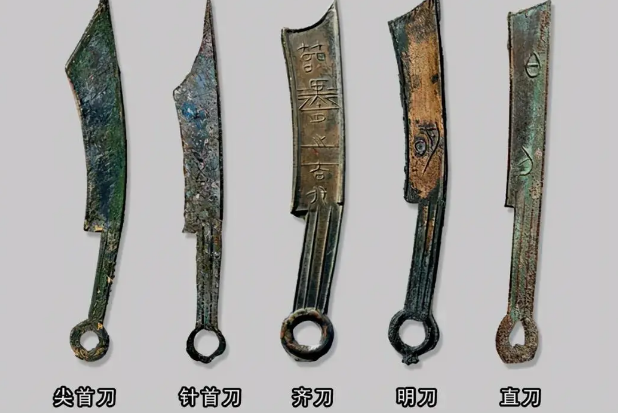 秦国环钱  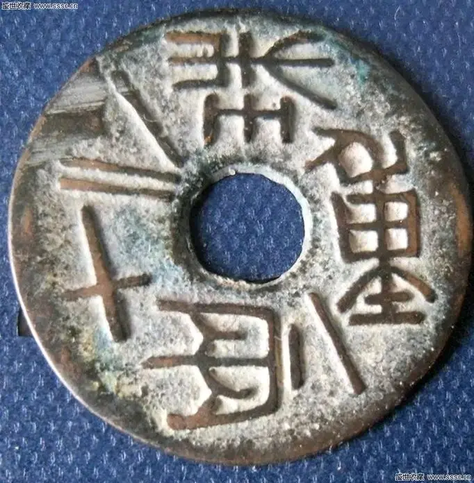 楚国蚁鼻钱 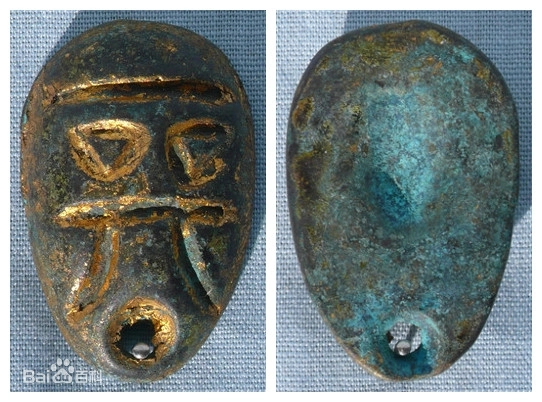

各异的货币形状都来源于各地域古人对重要物资的不同认知： 铲币来源于古代农耕使用的铲子形象，蚁鼻钱继承了贝币的形状，圆钱的形象取自纺轮或玉币，刀币来源于**古代实用的工具刀形象。** 在1980年代，考古学家在北京延庆军都山发掘的山戎部落墓地中，发现了原始的青铜刀削与尖首刀。侧面印证了**刀币是由古代实用的工具刀削演化而来的**。 秦朝统一六国后，货币形式统一为圆钱。在天圆地方学说的影响下，演变为影响后世2000余年的方孔圆钱。 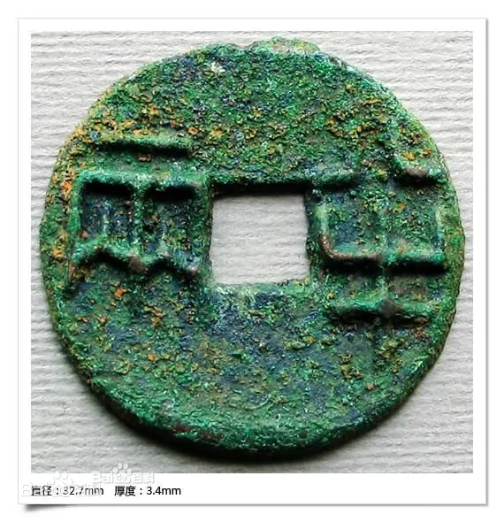 秦半两，早期方孔圆钱

### 不断演进的货币
**围边** 西汉晚期主流使用的五铢钱，增加了围边，以形制规矩。此后古代货币的形状基本固定。 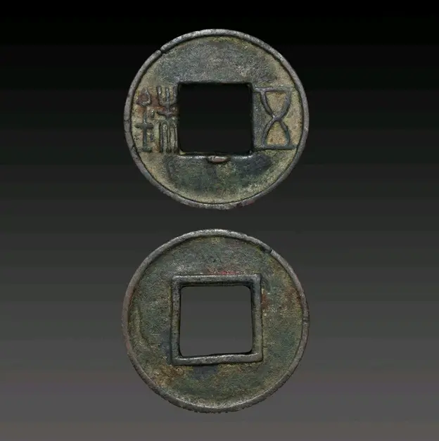 西汉五铢，是中国历史上使用时间最长的货币 **通宝钱/年号币** 中国最早的年号钱是十六国汉李寿所铸的“汉兴钱”（338—343年），但因时局动荡，年号币虽屡屡出现，都未能取代已广泛流行的铢两钱制。 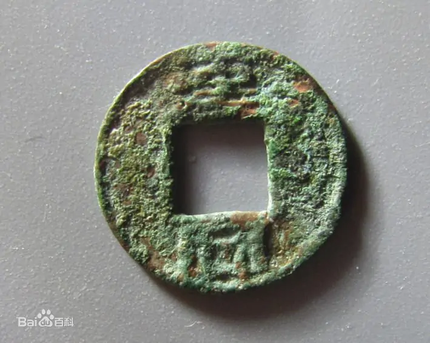 到了唐朝，高宗李渊统一天下后发行了著名的“开元通宝”，以整治当时混乱的币制，取代社会上遗存的五铢。开元通宝是第一种通宝钱，却并非年号钱。开元二字指开国，开辟新纪元之意。开元通宝的出现，取代了铢两钱制，后世的统治者也将开元二字替换为自己的年号，形成了为现代人了解的年号币制度。 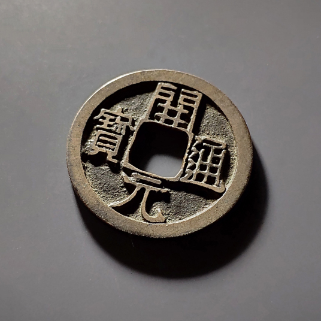

**纸币** 宋朝是一个经济水平和商品贸易十分发达的朝代，其当时的年人均GDP远超欧洲国家，在这样的时代背景下，沉重的铜钱和金银非常不便于大宗商品的贸易，在这样的时代背景下，我国历史上第一款纸币—“交子”就此诞生。 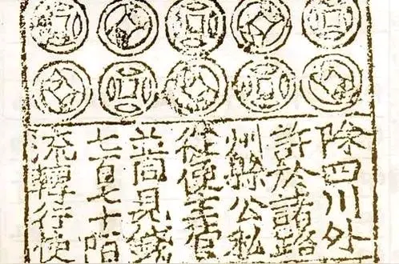 同时期的金国也仿照产生了交钞。由金海陵王在贞元二年发行 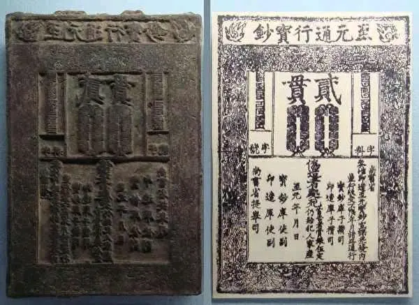

 **银币** 唐宋期间白银正式进入流通渠道，流通的形式从铤、饼、钣、笏、笋、锭、船形、银钱等。主要是用于官方、富贵人家的大笔交易。 明朝中期，随着经济进一步发展，银子开始成为流通中的主要货币，形成了以银为主、以铜钱为辅的银、钱并行的货币制度。明代银币的形式仍以银锭为主，最大的锭重五百两，一般元宝仍重五十两，还有各种小银锭和碎银两。银币的流行最终排挤了原始纸币。  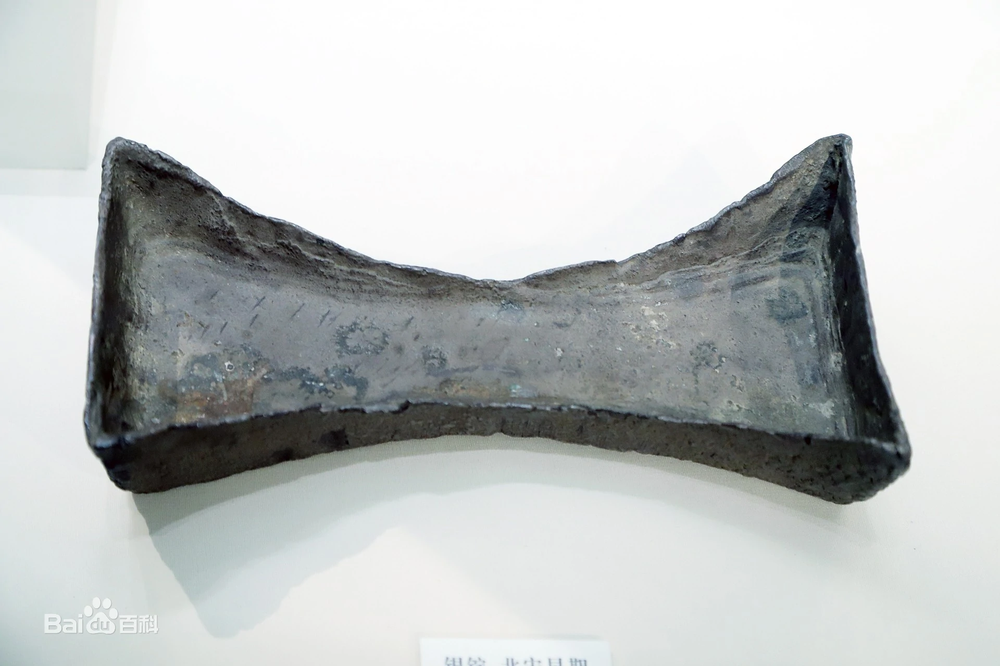 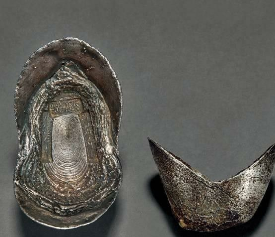 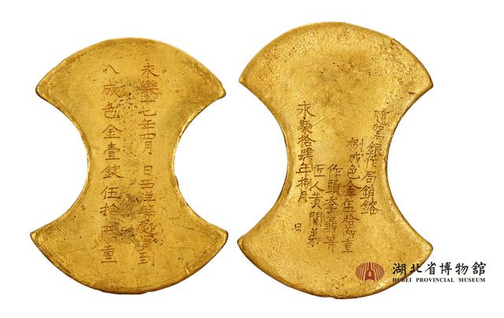

### 近现代的货币
**银元** 明清人们银钱混用，往往大笔交易用银，小笔交易用钱，没有统一标准。给流通造成了很大的障碍，也使货币制度陷入混乱局面。同时明清时期，具有统一价格标准的外国银元进入中国市场，给清代货币带来了极大的冲击。相较下外国银元具有极大的优势，广受欢迎。清政府在禁止遏制无效下不得不做出让步，于道光十六年(1836年)在法律上正式承认了外国银元的流通。（《南京条约》赔款用外国银元作为货币单位。后来，白银外流，没外国银元了，才换做用银两赔款。） 在这样的时局下，许多有识之士呼吁中国实行币制改革，将难以适应经济发展的银两制改为银元制。 
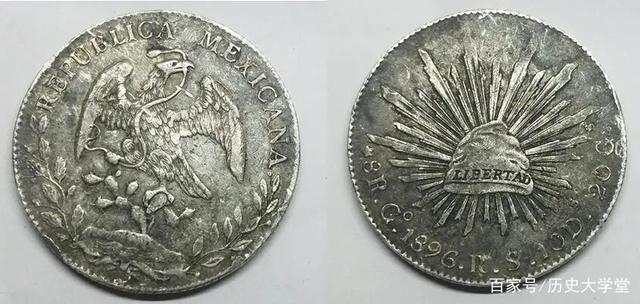
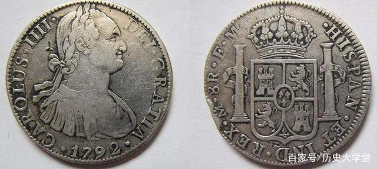
 西班牙银元 两广总督张之洞率先做出自铸造银元的尝试，他在广州设置钱局，于清光绪十五年(1889年)开制库平七钱三分的银元样币。正面为“光绪元宝”，背面为蟠龙图纹，故俗称“龙洋”。此后各省纷纷仿效张之洞的创举自铸造银元，先后有江南、北洋、浙江、安徽、奉天、吉林、湖南、福建、四川、云南等省开设钱局制造“龙洋”。 但在有清一朝，国家层面始终未出现统一实行的银元标准。 
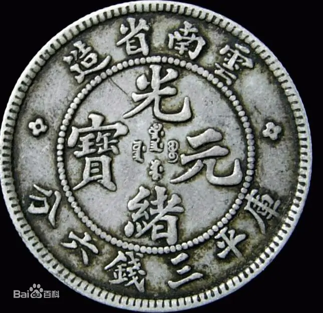
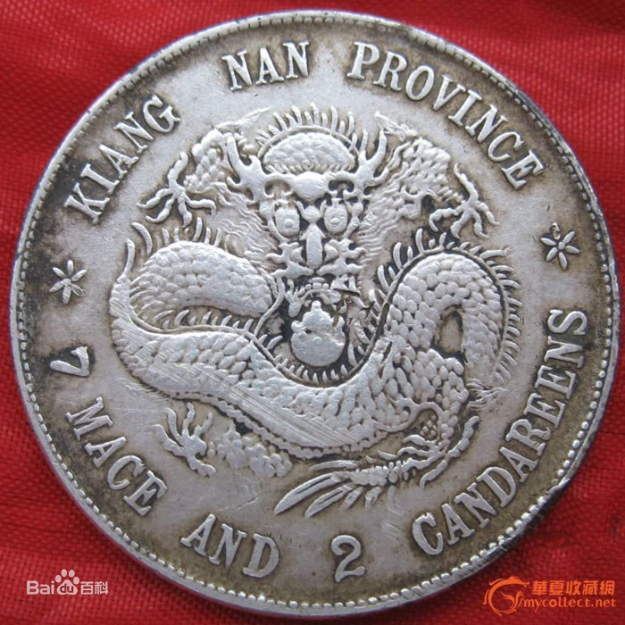
 清朝灭亡之后。北洋政府鉴于当时铸币、纸币十分复杂，流通的中外货币在百种以上，规格不一，决定铸发国币。袁世凯为了提高自己的统治地位，把他的头像铸于币面，“袁大头”由此而来。 
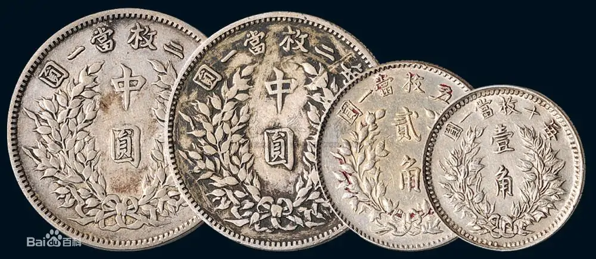
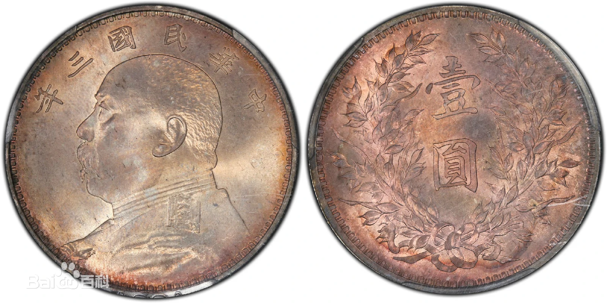
 **铜元** 铜元伴随着银元而产生，是我国近代货币体系的重要组成部分。我国铜元诞生于清光绪十五年（1889年），它是我国钱币史上“机制币”的开端。铜元中间无孔，系仿照香港铜辅币铸造而成，因此外观与历代的方孔铜钱不同。铜元的诞生标志着我国金属货币铸造工艺从传统的手工翻砂铸造进入了先进的机器化生产的新阶段。 
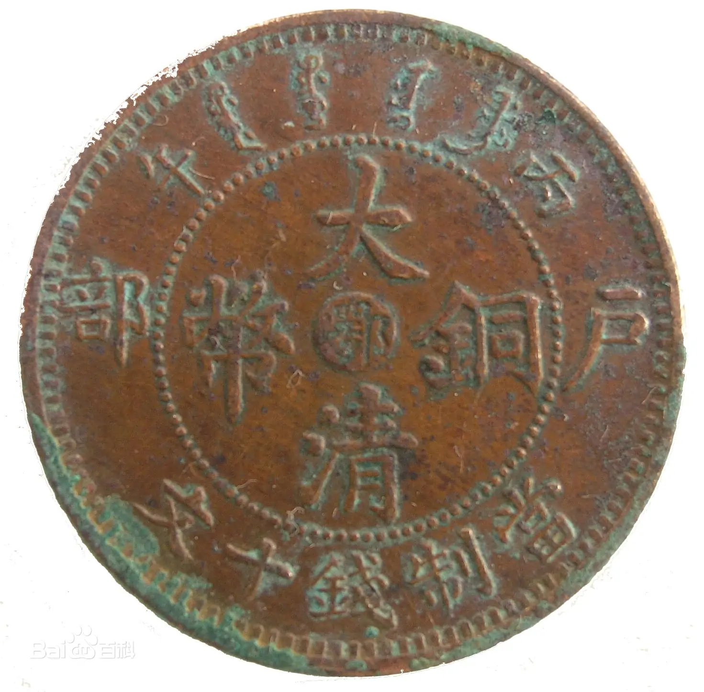
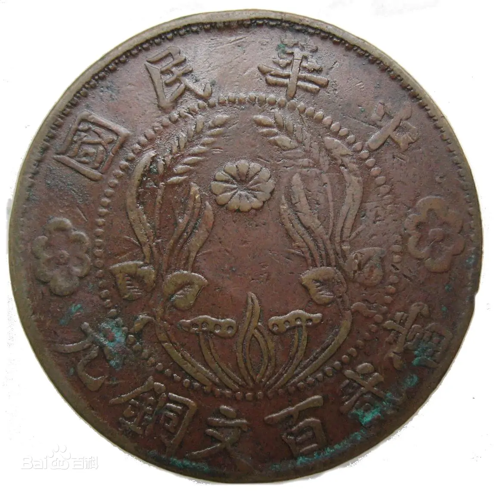
 **纸币** 除北洋政府的国家银行和一些商业银行发行钞票外，各地方银行及官银钱号仍与清末一样，皆继续发行各种纸币。特别是辛亥革命爆发后，各省因财政困难，均以发行纸币作为筹款手段，发行了大量的纸币。 二十世纪二、三十年代，受国际银价影响，中国白银外流，银本位币制无法持续，且国内的货币发行杂乱不堪。1935年，国民政府实行法币改革，规定中央银行、中国银行、交通银行所发行的钞票为法币（后加中国农民银行），并禁止银元的流通，将白银收为国有。从此时开始，国内的通用货币转向了纸币。 !

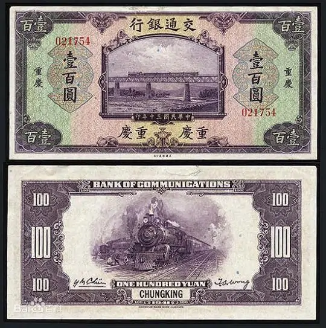

### 奇特货币
1、 陶土币 
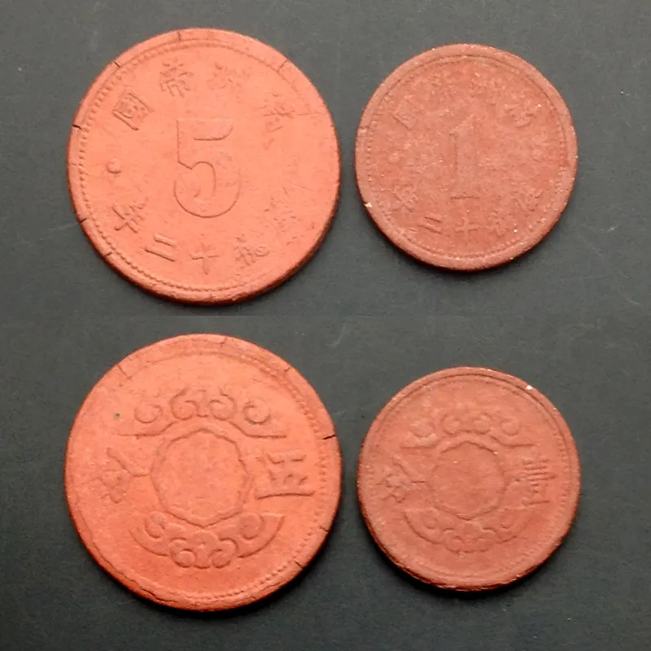
 伪满康德12年（1945年）发行，日本以伪满洲政府名义发行的陶土币，抗战胜利后退出历史舞台。它是日本侵华战争的铁证。也是人类历史上极其罕见的陶土货币(其他只有德国发行过)。 2、 三元人民币 
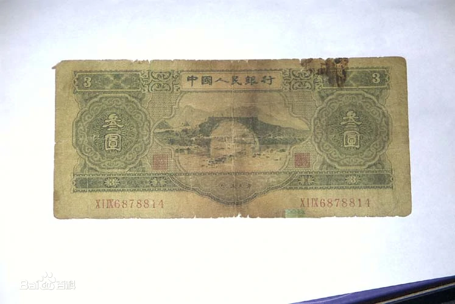
 发行时间是1955年3月1日，于1964年5月15日停止收兑和流通，产生的背景是，以苏联为师，照搬了俄国卢布的面额体系。 3、金错刀和它的兄弟们 
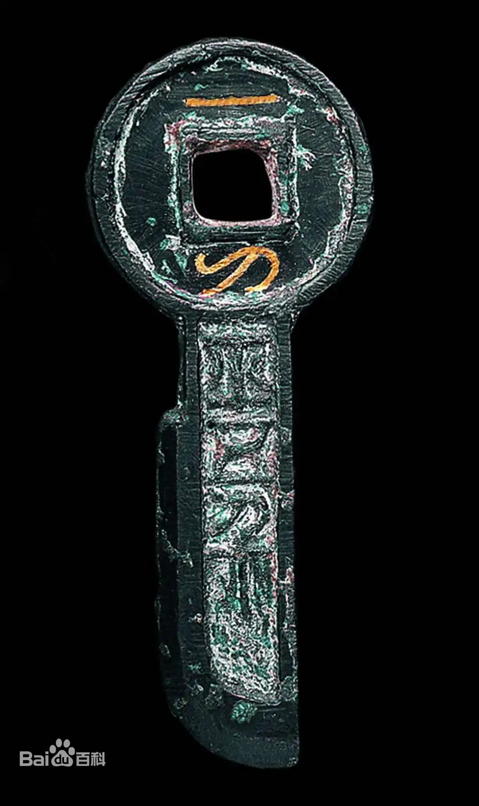
 又称一刀平五千，为中国古代最美的钱币之一，意思是一个金错刀价值五千文铜钱。当然，实际这种钱币包含的黄金重量远不值五千文。发行这种“不足值”的货币只是为了掠夺民间财富而已。与它类似的还有国宝金匮直万，但是其发行量极少，又被认为并非常规的流通货币。 
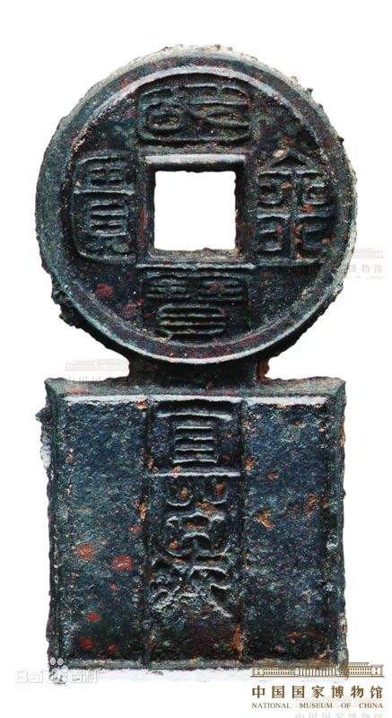
 
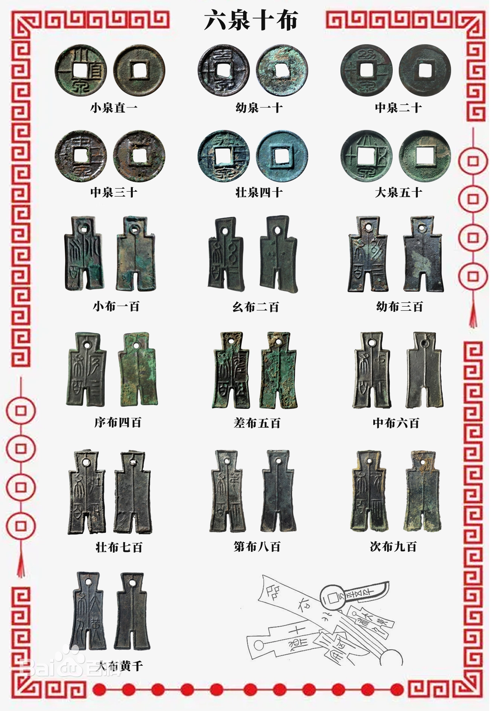
 这些小兄弟的特点就是面额大，发行量多。和金圆券类似，还极度不保值。 4、 史上最大面额 60亿圆纸币于1949年5月10日，由中华民国国民政府的新疆省银行发行（当时新疆称“省”而非现时的“自治区”），是中国历史上面额最大的纸币。在20天内一共发行480万张，总金额为2.88亿亿圆。 
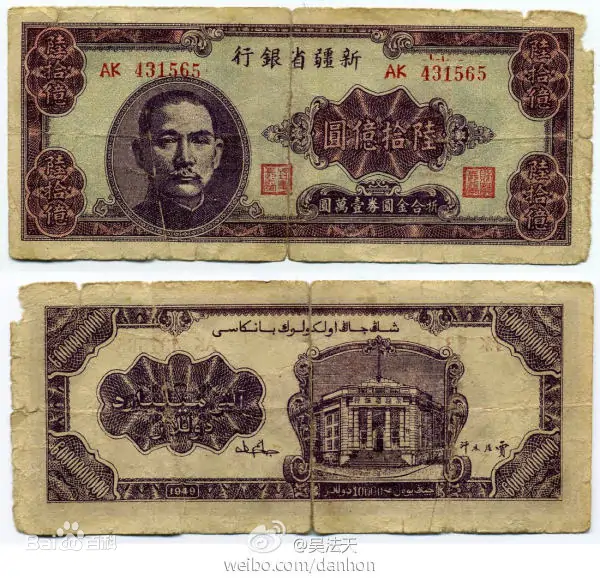
 这张60亿圆的钞票，在当时只值百分之一块银元。按当时上海一石米的价格是金圆券4.4亿元计算，这张60亿圆纸币只能买到88粒米。（按另一种计法，只能买到约77粒米。）

